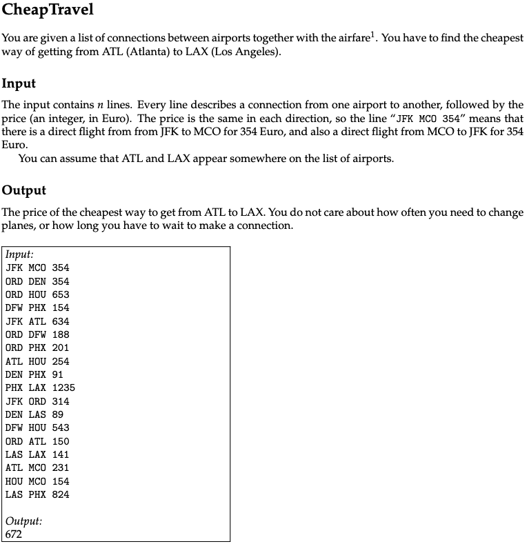
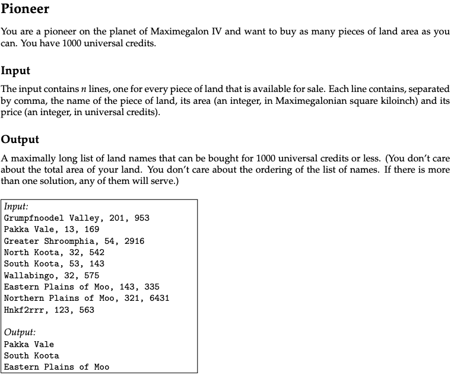
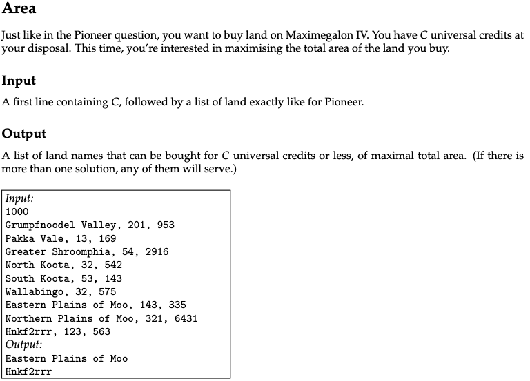
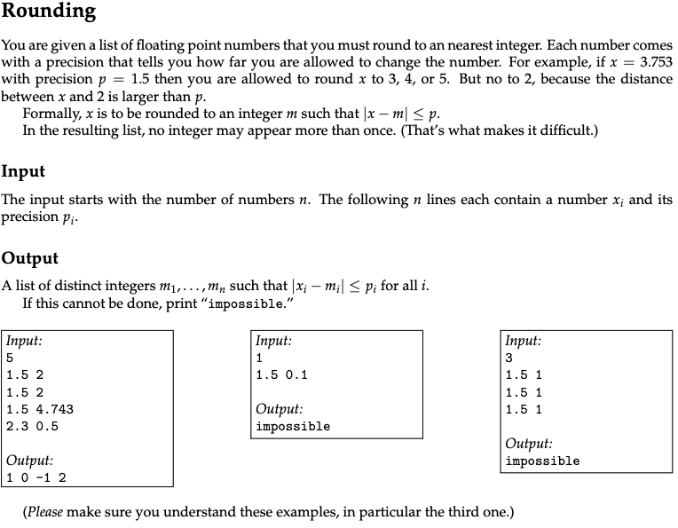
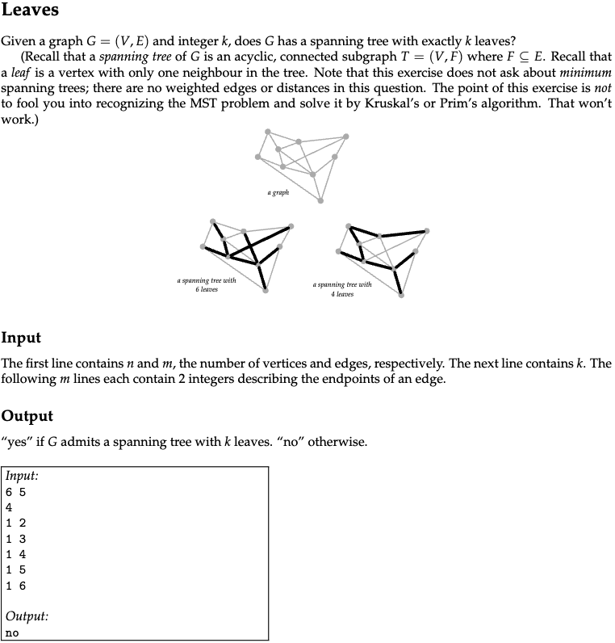
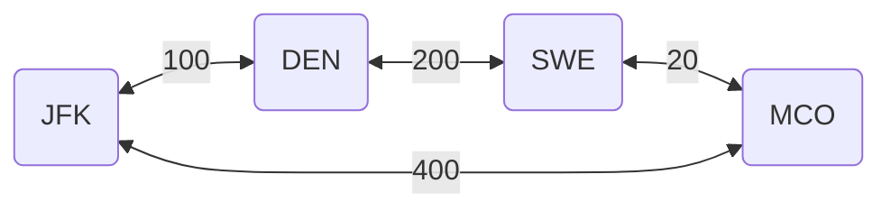
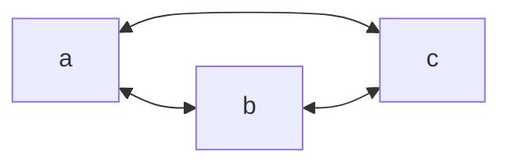
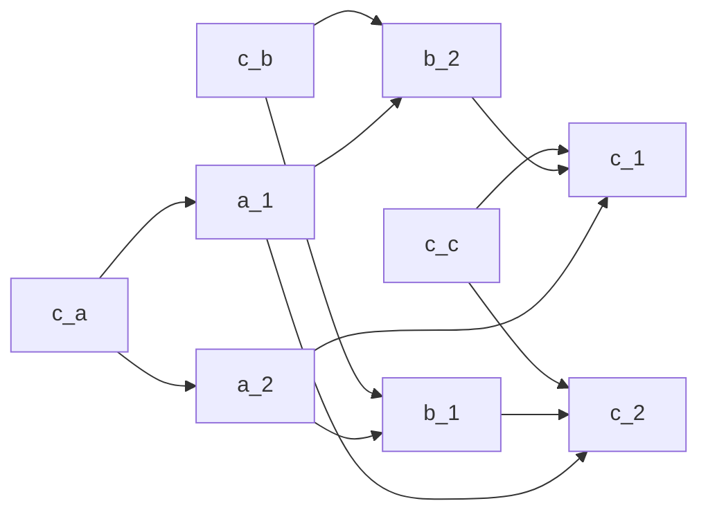
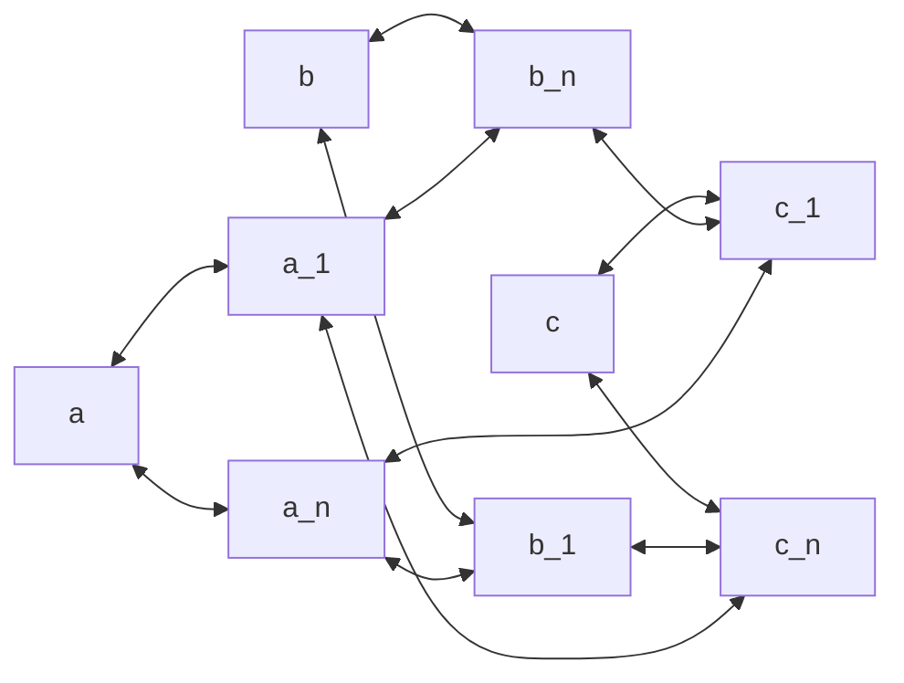

# Exam 2013

There are five exam questions in this set (on page 7 and 8), corresponding to the five algorithmic problems on pages 2–6. Answer them on a separate piece of paper.

- [Exam 2013](#exam-2013)
  - [Problems](#problems)
  - [Problem 1: CheapTravel - shortest path](#problem-1-cheaptravel---shortest-path)
  - [Problem 2: Pioneer - greedy](#problem-2-pioneer---greedy)
  - [Problem 3: Area - dynamic programming](#problem-3-area---dynamic-programming)
  - [Problem 4: Rounding - network flow](#problem-4-rounding---network-flow)
  - [Problem 5: Leaves - NP-hard, NP, NP-complete](#problem-5-leaves---np-hard-np-np-complete)
  - [Question 1](#question-1)
  - [Question 2](#question-2)
  - [Question 3](#question-3)
  - [Question 4](#question-4)
  - [Question 5](#question-5)
  - [Question 6](#question-6)
  - [Question 7](#question-7)

## Problems

## Problem 1: CheapTravel - shortest path



## Problem 2: Pioneer - greedy



## Problem 3: Area - dynamic programming



## Problem 4: Rounding - network flow



## Problem 5: Leaves - NP-hard, NP, NP-complete



## Question 1

### 1.a (1 pt.)

What is the running time of the following piece of code in terms of $n$ and $m$?

```pseudo
for i = 1 to n:
    j = 1
    while j < m:
        print j
        j = j + 1
    endwhile
endfor
```

### 1.a - answer

Assuming that the outer loop is also responsible for incrementing the value of $i$ then the running time will be $O(n * m)$.
This is due to the inner loop running $m$ times for each iteration of the outer loop.

### 1.b (1 pt.)

Give a recurrence relation for the running time of the following method as a function of $n$.
(Don’t solve the recurrence.)

```pseudo
function f(int n):
    if (n < 1) then return 5
    else return f(n-1) * f(n-2)
```

### 1.b - answer

If $n$ is less than 1 then the running time is constant, thus:

$$
T(n) = O(1), ~ for ~ n < 1
$$

This is the base case, otherwise the function will call itself twice with $n-1$ and $n-2$ as arguments.
This will result in the following recursive case:

$$
T(n) = T(n-1) + T(n-2) + O(1), ~ for ~ n \geq 1
$$

## Question 2

One of the problems in the set can be solved greedily.

### 2.a (1 pt.)

Which one?

### 2.a - answer

"Pioneer" can be solved greedily as we only care for the amount of pieces of land and not the actual pieces themselves.
This can thus be solved by just buying the cheapest pieces of land until we do not have more credits left.

### 2.b (2 pt.)

Describe the algorithm, for example by writing it in pseudocode. (Ignore parsing the input.)  
You probably want to process the input in some order; be sure to make it clear **which order** this is (increasing or decreasing order of start time, alphabetic, colour, age, size, x-coordinate, distance, number of neighbours, scariness, etc.).  
In other words, don’t just write “sort the input.”

### 2.b - answer

The algorithm should sort the land areas in increasing order of price.
Then we can iterate over the sorted list and buy the land areas as long as we have enough credits left.
Whilst buying can keep track of the total amount of land masses we have bought and also print the land area name.
Thus the algorithm can be described as follows:

```pseudo
land_areas = sort(land_areas, increasing order of price)
credits = some number

func pioneer(credits, land_areas) {
  total_land_masses = 0

  foreach (land_area in land_areas) {
    if (credits >= land_area.price) {
      credits -= land_area.price
      total_land_masses += 1
      print(land_area.name)
    }
    else { break }
  }

  return total_land_masses
}

print(pioneer(credits, land_areas))
```

### 2.c (1 pt.)

State the running time of your algorithm in terms of the original parameters. (It must be polynomial in the original size.)

### 2.c - answer

The running time of the algorithm is $O(n \log n)$ where $n$ is the number of land areas.
The reason for this is that we first sort the land areas in $O(n \log n)$ time and then iterate over the sorted list in $O(n)$ time.

## Question 3

One of the problems can be efficiently reduced to a shortest path or connectivity problem in graphs.

### 3.a (1 pt.)

Which one?

### 3.a - answer

"CheapTravel" can be reduced to a shortest path problem in a graph.
The reason is that we can consider the price as the cost of moving from one airport to another.

### 3.b (2 pt.)

Explain how the graph looks:

- What are the vertices, and how many are there?  
- What are the edges, and how many are there?  
- Is the graph directed?  
- Are there weights on the edges?  
Draw a small example instance.

### 3.b - answer

- The vertices of the graph are the airports and there are $n$ of them.
- The edges of the graph are the flights between the airports and there are $m$ of them.
- The graph is undirected as if we get the input `JFK MCO 354` then we can both fly from JFK to MCO and from MCO to JFK.
- The weights on the edges are the prices of the flights.

Thus the following input instance can be displayed the following graph:

```pseudo
JFK DEN 100
DEN SWE 200
SWE MCO 20
MCO JFK 400
```



### 3.c (1 pt.)

Briefly explain which algorithm you use (BFS? DFS? Dijkstra? Is it important?).

### 3.c - answer

DFS and BFS are not suitable for this problem as they do not take into account the cost of the flights.
Thus we should use Dijkstra's algorithm as it is a shortest path algorithm that can take into account the cost of the flights.

### 3.d (1 pt.)

State the running time of your algorithm in terms of the original parameters. (It must be polynomial in the original size.)

### 3.d - answer

The running time of Dijkstra's algorithm is $O((n + m) \log n)$ where $n$ is the number of airports and $m$ is the number of flights.
Thus of course assumes that we use a priority queue to store the vertices.

## Question 4

One of the problems is solved by dynamic programming.

### 4.a (1 pt.)

Which one?

### 4.a - answer

"Area" can be solved with dynamic programming.
The reason for not being able to use a greedy algorithm is that we both need to consider the price and the area of the land mass.
Thus dynamic programming has to be used as we have to take the subproblems into account.

### 4.b (3 pt.)

Following the book’s notation, we let $\text{OPT}(i)$ denote the value of a partial solution. (Maybe you need more than one parameter, like $\text{OPT}(i, j)$. Who knows?)  
Give a recurrence relation for $\text{OPT}$, including relevant boundary conditions and base cases.

### 4.b - answer

The boundary condition for this problem is the amount of credits we have - which we can denote as $C$.
The price of the land mass will be denoted as $C_i$ and the area of the land as $A_i$.
Thus we can define the partial solution as $\text{OPT}(i, C)$ where $i$ is the index of the land area.

For each land mass we have two choices:

- Exclude the land mass
  - $\text{OPT}(i, C) = \text{OPT}(i-1, C) \text{if}$
- Buy the land mass $i$
  - $\text{OPT}(i, C) = A_i + \text{OPT}(i-1, C-C_i)$

The optimal solution of the two choices are the maximum of the two. Thus:

$$
\text{OPT}(i, C) = \max(\text{OPT}(i-1, C), A_i + \text{OPT}(i-1, C-C_i))
$$

Furthermore we have the following two base cases:

- No more land masses
  - $\text{OPT}(0, C) = 0$
- No more credits
  - $\text{OPT}(i, 0) = 0$

Thus we can set up the following recurrence relation:

$$
\text{OPT}(i, C) = \begin{cases}
  0, & \text{if} ~ i = 0 ~ \text{or} C = 0 \\
  \text{OPT}(i-1, C), & \text{if} C_i > C \\
  \max(\text{OPT}(i-1, C), A_i + \text{OPT}(i-1, C-C_i)), & \text{otherwise}\\
\end{cases}
$$

### 4.c (1 pt.)

State the running time and space of the resulting algorithm.

### 4.c - answer

The running time of the algorithm is $O(i \times C)$ where $i$ is the number of land masses and $C$ is the amount of credits.

The space complexity of the algorithm is $O(i \times C)$ as we have to store the results of the subproblems in a table.

## Question 5

One of the problems in the set is easily solved by a reduction to network flow.

### 5.a (1 pt.)

Which one?

### 5.a - answer

"Rounding" can be solved by reducing it to a network flow problem.
At first glance "Leaves" could also look like a network flow problem but there needs to be a another algorithm added upon the network flow to ensure that the resulting graph is a spanning tree.

### 5.b (3 pt.)

Describe the reduction. Be ridiculously precise about which nodes and arcs there are, how many there are (in terms of size measures of the original problem), how the nodes are connected and directed, and what the capacities are.  
Do this in general (use words like “every node corresponding to a giraffe is connected to every node corresponding to a letter by an undirected arc of capacity the length of the neck”), and also draw a small, but complete example for an example instance.  
What does a maximum flow mean in terms of the original problem, and what size does it have in terms of the original parameters?

### 5.b - answer

First of I want to describe the denotations of the variables:

- $n$ denotes the number of floating point numbers
- $p$ denotes the precision
- $s$ denotes the source node
- $t$ denotes the sink/terminal node

The reduction can be described as follows:

1. Create the source node $s$ and connect it to all the floating point numbers with a capacity of 1.
2. Create all the possible rounded numbers, lets call them $r$, and connect each $n$ to its corresponding $r$s with a capacity of 1.
3. Create the sink node $t$ and connect all the $r$s to $t$ with a capacity of 1.
4. Push $|n|$ units of flow from $s$ to $t$.
  If the flow is less than $|n|$ then we have not found a solution. We can then try to change the precision and try again.

Thus we end up reducing the problem to a network flow problem where we have to find the maximum flow in the graph.

> Note: For the reduction to work we also have to keep track of the residual graph and the augmenting paths.
> Thus we can provide which floating point numbers are rounded to which rounded numbers.

### 5.c (1 pt.)

State the running time of the resulting algorithm, be precise about which flow algorithm you use.  
(Use words like “Using Bellman–Ford (p. 5363 of the textbook), the total running time will be $O(n^{17} \log^3 e + \log^2 m)$.”)

### 5.c - answer

As the problem has been fully reduced to a network flow problem we can use the Ford-Fulkerson algorithm to find the maximum flow in the graph.

Thus the running time of the algorithm will be $O((E + V) \cdot |n|)$ where $E$ is the number of edges, $V$ is the number of vertices and $|n|$ is the number of floating point numbers which is also what we want to achieve as the maximum flow.

## Question 6

We will show that Leaves belongs to NP by describing a certificate.

### 6.a (1 pt.)

Is Leaves a decision problem? Answer “yes” or “no.” If “no,” describe the decision version of Leaves: what are the inputs, what are the outputs?

### 6.a - answer

"Leaves" is a decision problem as we have to output if a given $G$ there exists a minimal spanning tree with exactly $k$ leaves.
It would not have been a decision problem if we had to output the actual spanning tree.

### 6.b (1 pt.)

Describe a certificate for Leaves. In particular, give an example of such a certificate for a small instance. How long is this certificate in terms of the instance size?

### 6.b - answer

For the "Leaves" problem the certificate would provide a list of the leaves would have to be provided as well as the rest of the edges and vertices in the graph.

Then to verify the certificate we would have to check that:

- The leaves only one degree
- The graph is connected
- The graph is acyclic

### 6.c (1 pt.)

Describe very briefly how your certificate can be checked. In particular, what is the running time of that procedure?

### 6.c - answer

The certificate can be checked by:

- Iterating over all leaves and checking that they only have one degree
  - Running time: $O(k)$
- Run either DFS or BFS to check that the graph is connected and acyclic
  - Running time: $O(V + E)$

The total running time of the procedure is thus $O(V + E + k)$.

But as this is a check for a minimal spanning tree we know that $|E| = |V| - 1$.
Thus if $|E| > |V| - 1$ then we can terminate the check early as it is not a valid spanning tree.

Thus the final running time remains the same as $O(V + E + k)$ but can be simplified to $O(V + k)$.

## Question 7

One of the problems in the set is NP-complete.

### 7.a (1 pt.)

Which problem is it? (Let’s call it $P_1$.)

### 7.a - answer

"Leaves" is NP-complete.

The reason for this is that "Leaves" is:

- A decision problem
- Itself is NP-hard
- A solution to "Leaves" can be verified in polynomial time (and is thus in NP)

#### 7.a - "Leaves" detailed explanation

The **"Leaves"** problem asks whether a given graph \( G = (V, E) \) has a spanning tree with exactly \( k \) leaves. A spanning tree is a connected, acyclic subgraph of \( G \) that spans all vertices in \( V \). The leaves in the spanning tree are vertices with degree 1, while the internal nodes ensure connectivity.

To better understand the complexity of "Leaves" and its connection to NP-completeness, we can frame the problem as a **network flow problem**:

##### 7.a - Denotations

We define the following variables:

- $G$: The graph.
- $V$: The set of vertices in the graph.
- $E$: The set of edges in the graph.
- $k$: The desired number of leaves in the spanning tree.
- $s'$: A newly created source node (sink prime).
- $t'$: A newly created sink node (terminal prime).
- $r$: The root node, chosen arbitrarily from $V$, and connected to $s'$.

##### 7.a - Reduction to a Network Flow Problem

To solve "Leaves" using network flow, we can transform the problem as follows:

1. **Assign Infinite Capacities**:
   - Assign all edges $E$ in the graph $G$ a capacity of infinity. This ensures that there are no artificial bottlenecks between nodes, allowing unrestricted flow.

2. **Create the Source Node $s'$**:
   - Add a new source node $s'$ and connect it to an arbitrary vertex $r \in V$ (the root node) with an edge of capacity $k$. This enforces that exactly $k$ units of flow are introduced into the graph from $s'$.

3. **Create the Sink Node $t'$**:
   - Add a new sink node $t'$.
   - Connect $t'$ to $k$ arbitrary nodes $\{v_1, v_2, \dots, v_k\} \subset V$, excluding the root node $r$, with edges of capacity 1. This ensures that exactly $k$ units of flow exit the graph via these nodes.

4. **Push $k$ Units of Flow**:
   - Push $k$ units of flow from $s'$ to $t'$.
   - If the maximum flow is less than $k$, then it is impossible to form a spanning tree with exactly $k$ leaves. In this case, you must modify the choice of $t'$-connected nodes and try again.

5. **Form the Spanning Tree**:
   - After achieving a maximum flow of $k$, examine the edges with non-zero flow. These edges should form a connected, acyclic subgraph of $G$ that spans all vertices in $V$.
   - If this subgraph has exactly $k$ vertices of degree 1 (leaves), it is a valid solution to the "Leaves" problem.

#### 7.a - Notes and Limitations

- **Integer Flow**: This reduction assumes integer flow, as fractional flow would result in solutions that do not correspond to valid spanning trees.
- **Iteration**: If the choice of nodes connected to $t'$ does not yield a valid spanning tree, iterate over new configurations of sink-connected nodes.

This framing connects "Leaves" to a polynomial verifiable structure, showing that solutions can be checked efficiently. By solving the network flow problem and validating the resulting subgraph, we can verify a solution to "Leaves."

### 7.b (1 pt.)

The easiest way to show that $P_1$ is NP-hard is to consider another NP-hard problem (called $P_2$). Which one?

### 7.b - answer

"Graph colouring" is known to be NP-hard.
Thus we say that "Graph colouring" is $P_2$.

### 7.c (1 pt.)

Do you now need to prove $P_1 \leq_p P_2$ or $P_2 \leq_p P_1$?

### 7.c - answer

The following are additions to the denotations:

- $C_v = \{v_1, v_2, \dots, v_k\}$: The set of $k$ duplicate nodes representing possible colors for vertex $v$.
- $E_{C}$: Edges added between $u_i \in C_u$ and $v_j \in C_v$ for $i \neq j$, ensuring adjacent vertices $u$ and $v$ cannot share the same color.

To show that $P_1 \leq_p P_2$, or that "Leaves" is NP-hard, we have to reduce "Graph colouring" to "Leaves".
Which will then prove that "Leaves" is NP-hard as well.

The previous denotations from "Leaves" are still valid.

#### 7.c - Reduction from "Graph colouring" to "Leaves"

1. For each vertex $v \in V$, create $k$ duplicate nodes $C_v = \{v_1, v_2, \dots, v_k\}$, where $k$ is the number of colors.
   - Add edges between the original node $v$ and each of its duplicates $v_i$, ensuring exactly one duplicate node is selected in the spanning tree.
2. For each edge $(u, v) \in E$, add edges between $u_i \in C_u$ and $v_j \in C_v$ for $i \neq j$.
   - This ensures that adjacent vertices $u$ and $v$ cannot share the same color.
3. Set the Leaves problem parameter $k' = |V|$, the number of original vertices. This ensures one leaf is selected per vertex.

Thus, as "Graph Coloring" (a known NP-hard problem) can be reduced to "Leaves," it proves that "Leaves" is NP-hard. Furthermore, it validates that $P_2 \leq_p P_1$.

### 7.d (3 pt.)

Describe the reduction. Do this both in general and for a small but complete example. In particular, be ridiculously precise about what instance is **given**, and what instance is **constructed** by the reduction, the parameters of the instance you produce (for example, number of vertices, edges, sets, colors) in terms of the parameters of the original instance, and what the solution of the transformed instance means in terms of the original instance.

### 7.d - answer

#### 7.d - general case

We get an input for "Graph colouring" which consists of vertices $V$, edges $E$, and the number of colours $k$.

We are then expected to check if we can colour the graph with $k$ colours such that no two adjacent nodes have the same colour.

#### 7.d - example

We start with the graph $G = (V = \{a, b, c\}, E = \{(a, b), (a, c), (b, c)\})$ and $k = 2$ colors:



To reduce to "Leaves" we thus have to:

- $C_a = \{a_1, a_2\}, C_b = \{b_1, b_2\}, C_c = \{c_1, c_2\}$, representing the two colours for $a$, $b$, and $c$ respectively.
- Add central nodes $c_a$, $c_b$, and $c_c$ to connect the original nodes to their respective colour nodes.
  - $c_a \leftrightarrow a_1, a_2$
  - $c_b \leftrightarrow b_1, b_2$
  - $c_c \leftrightarrow c_1, c_2$
- Add edges to enforce colouring constraints:
  - $a_1 \leftrightarrow b_2, a_2 \leftrightarrow b_1$
  - $b_1 \leftrightarrow c_2, b_2 \leftrightarrow c_1$
  - $a_1 \leftrightarrow c_2, a_2 \leftrightarrow c_1$

Thus the new graph can be represented as:



- Create two new nodes for each node in $V$.
- Connect the new nodes to the original nodes with a capacity of 1.
- Connect the new nodes to the other new nodes which the original nodes are connected to with a capacity of 1 - but only if they are not adjacent.

Thus the new graph can be shown as:



#### 7.d - Explanation

To solve the "Leaves" problem on the reduced graph, we aim to construct a spanning tree with $k' = |V|$ leaves (one leaf for each vertex in the original graph). Here’s how the reduction ensures that this corresponds to a valid $k$-coloring of the original graph:

1. **Leaves Represent Selected Colors**:
   - In the reduced graph, each original vertex $v \in V$ is associated with $k$ duplicate nodes $C_v = \{v_1, v_2, \dots, v_k\}$, representing its possible colors.
   - The spanning tree selects exactly one node $v_i \in C_v$ for each $v$. This selection corresponds to choosing a color for $v$.

2. **Coloring Constraints**:
   - Edges $u_i \leftrightarrow v_j$ are added between $C_u$ and $C_v$ to ensure that adjacent vertices $u$ and $v$ in the original graph $G$ cannot share the same color. These edges enforce $i \neq j$.

3. **Spanning Tree Selection**:
   - A valid spanning tree with $k' = |V|$ leaves ensures that:
     - Exactly one color node is selected for each original vertex
