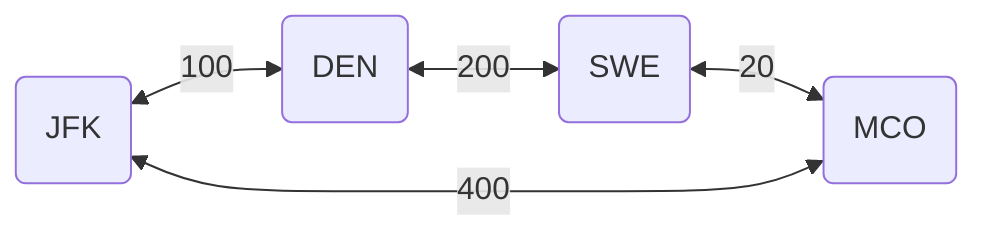

# Exam 2013

There are five exam questions in this set (on page 7 and 8), corresponding to the five algorithmic problems on pages 2–6. Answer them on a separate piece of paper.

---

## Question 1

### 1.a (1 pt.)

What is the running time of the following piece of code in terms of $n$ and $m$?

```pseudo
for i = 1 to n:
    j = 1
    while j < m:
        print j
        j = j + 1
    endwhile
endfor
```

### 1.a - answer

Assuming that the outer loop is also responsible for incrementing the value of $i$ then the running time will be $O(n * m)$.
This is due to the inner loop running $m$ times for each iteration of the outer loop.

### 1.b (1 pt.)

Give a recurrence relation for the running time of the following method as a function of $n$.
(Don’t solve the recurrence.)

```pseudo
function f(int n):
    if (n < 1) then return 5
    else return f(n-1) * f(n-2)
```

### 1.b - answer

If $n$ is less than 1 then the running time is constant, thus:

$$
T(n) = O(1), ~ for ~ n < 1
$$

This is the base case, otherwise the function will call itself twice with $n-1$ and $n-2$ as arguments.
This will result in the following recursive case:

$$
T(n) = T(n-1) + T(n-2) + O(1), ~ for ~ n \geq 1
$$

## Question 2

One of the problems in the set can be solved greedily.

### 2.a (1 pt.)

Which one?

### 2.a - answer

"Pioneer" can be solved greedily as we only care for the amount of pieces of land and not the actual pieces themselves.
This can thus be solved by just buying the cheapest pieces of land until we do not have more credits left.

### 2.b (2 pt.)

Describe the algorithm, for example by writing it in pseudocode. (Ignore parsing the input.)  
You probably want to process the input in some order; be sure to make it clear **which order** this is (increasing or decreasing order of start time, alphabetic, colour, age, size, x-coordinate, distance, number of neighbours, scariness, etc.).  
In other words, don’t just write “sort the input.”

### 2.b - answer

The algorithm should sort the land areas in increasing order of price.
Then we can iterate over the sorted list and buy the land areas as long as we have enough credits left.
Whilst buying can keep track of the total amount of land masses we have bought and also print the land area name.
Thus the algorithm can be described as follows:

```pseudo
land_areas = sort(land_areas, increasing order of price)
credits = some number

func pioneer(credits, land_areas) {
  total_land_masses = 0

  foreach (land_area in land_areas) {
    if (credits >= land_area.price) {
      credits -= land_area.price
      total_land_masses += 1
      print(land_area.name)
    }
    else { break }
  }

  return total_land_masses
}

print(pioneer(credits, land_areas))
```

### 2.c (1 pt.)

State the running time of your algorithm in terms of the original parameters. (It must be polynomial in the original size.)

### 2.c - answer

The running time of the algorithm is $O(n \log n)$ where $n$ is the number of land areas.
The reason for this is that we first sort the land areas in $O(n \log n)$ time and then iterate over the sorted list in $O(n)$ time.

## Question 3

One of the problems can be efficiently reduced to a shortest path or connectivity problem in graphs.

### 3.a (1 pt.)

Which one?

### 3.a - answer

"CheapTravel" can be reduced to a shortest path problem in a graph.
The reason is that we can consider the price as the cost of moving from one airport to another.

### 3.b (2 pt.)

Explain how the graph looks:

- What are the vertices, and how many are there?  
- What are the edges, and how many are there?  
- Is the graph directed?  
- Are there weights on the edges?  
Draw a small example instance.

### 3.b - answer

- The vertices of the graph are the airports and there are $n$ of them.
- The edges of the graph are the flights between the airports and there are $m$ of them.
- The graph is undirected as if we get the input `JFK MCO 354` then we can both fly from JFK to MCO and from MCO to JFK.
- The weights on the edges are the prices of the flights.

Thus the following input instance can be displayed the following graph:

```pseudo
JFK DEN 100
DEN SWE 200
SWE MCO 20
MCO JFK 400
```



### 3.c (1 pt.)

Briefly explain which algorithm you use (BFS? DFS? Dijkstra? Is it important?).

### 3.c - answer

DFS and BFS are not suitable for this problem as they do not take into account the cost of the flights.
Thus we should use Dijkstra's algorithm as it is a shortest path algorithm that can take into account the cost of the flights.

### 3.d (1 pt.)

State the running time of your algorithm in terms of the original parameters. (It must be polynomial in the original size.)

### 3.d - answer

The running time of Dijkstra's algorithm is $O((n + m) \log n)$ where $n$ is the number of airports and $m$ is the number of flights.
Thus of course assumes that we use a priority queue to store the vertices.

## Question 4

One of the problems is solved by dynamic programming.

### 4.a (1 pt.)

Which one?

### 4.a - answer

"Area" can be solved with dynamic programming.
The reason for not being able to use a greedy algorithm is that we both need to consider the price and the area of the land mass.
Thus dynamic programming has to be used as we have to take the subproblems into account.

### 4.b (3 pt.)

Following the book’s notation, we let $\text{OPT}(i)$ denote the value of a partial solution. (Maybe you need more than one parameter, like $\text{OPT}(i, j)$. Who knows?)  
Give a recurrence relation for $\text{OPT}$, including relevant boundary conditions and base cases.

### 4.b - answer

The boundary condition for this problem is the amount of credits we have - which we can denote as $C$.
The price of the land mass will be denoted as $C_i$ and the area of the land as $A_i$.
Thus we can define the partial solution as $\text{OPT}(i, C)$ where $i$ is the index of the land area.

For each land mass we have two choices:

- Exclude the land mass
  - $\text{OPT}(i, C) = \text{OPT}(i-1, C) \text{if}$
- Buy the land mass $i$
  - $\text{OPT}(i, C) = A_i + \text{OPT}(i-1, C-C_i)$

The optimal solution of the two choices are the maximum of the two. Thus:

$$
\text{OPT}(i, C) = \max(\text{OPT}(i-1, C), A_i + \text{OPT}(i-1, C-C_i))
$$

Furthermore we have the following two base cases:

- No more land masses
  - $\text{OPT}(0, C) = 0$
- No more credits
  - $\text{OPT}(i, 0) = 0$

Thus we can set up the following recurrence relation:

$$
\text{OPT}(i, C) = \begin{cases}
  0, & \text{if} ~ i = 0 ~ \text{or} C = 0 \\
  \text{OPT}(i-1, C), & \text{if} C_i > C \\
  \max(\text{OPT}(i-1, C), A_i + \text{OPT}(i-1, C-C_i)), & \text{otherwise}\\
\end{cases}
$$

### 4.c (1 pt.)

State the running time and space of the resulting algorithm.

### 4.c - answer

The running time of the algorithm is $O(i \times C)$ where $i$ is the number of land masses and $C$ is the amount of credits.

The space complexity of the algorithm is $O(i \times C)$ as we have to store the results of the subproblems in a table.

## Question 5

One of the problems in the set is easily solved by a reduction to network flow.

### 5.a (1 pt.)

Which one?

### 5.a - answer

"Leaves" can be solved by reducing it to a network flow problem.

### 5.b (3 pt.)

Describe the reduction. Be ridiculously precise about which nodes and arcs there are, how many there are (in terms of size measures of the original problem), how the nodes are connected and directed, and what the capacities are.  
Do this in general (use words like “every node corresponding to a giraffe is connected to every node corresponding to a letter by an undirected arc of capacity the length of the neck”), and also draw a small, but complete example for an example instance.  
What does a maximum flow mean in terms of the original problem, and what size does it have in terms of the original parameters?

### 5.b - answer

First of I want to describe the denotations of the variables:

- $G$ denotes the graph
- $V$ denotes the set of vertices
- $E$ denotes the set of edges
- $k$ denotes the desired number of leaves
- $s'$ denotes the source node/sink prime
- $t'$ denotes the sink node/terminal prime
- $r$ denotes the root node which is the node connected to $s'$

The reduction can be described as follows:

1. Assign all the edges $E$ in the graph $G$ a capacity of infinity. This will ensure unrestricted flow between the nodes.
2. Create a source node $s'$ and connect it to an arbitrary node from $V$ with a capacity of $k$. This ensures $k$ units of flow is pushed into the graph from $r$.
3. Create a sink node $t'$ and connect it to $k$ many arbitrary nodes from $V$, excluding $r$, with a capacity of 1. This ensures that we can only push $k$ units of flow out of the graph.
4. Push $k$ units of flow from $s'$ into the graph. If the flow is less than $k$ then we have not found a solution. We can then try to change the arbitrary nodes connected to $t'$ and try again.

> Note: The above reduction is only valid if we do not accept fractional flow in the graph and only integer flow.

After achieving $k$ units of flow, the edges with non-zero flow should form a connected, acyclic graph.
If the resulting subgraph is a spanning tree with exactly $k$ leaves, then the solution is valid.
Otherwise, iterate over new configurations.

### 5.c (1 pt.)

State the running time of the resulting algorithm, be precise about which flow algorithm you use.  
(Use words like “Using Bellman–Ford (p. 5363 of the textbook), the total running time will be $O(n^{17} \log^3 e + \log^2 m)$.”)

### 5.c - answer

The solution to the problem can use the Ford-Fulkerson algorithm to find the maximum flow in the graph.
The running time of the Ford-Fulkerson algorithm is $O((E + V) \cdot k)$.

But since we have to potentially try all possible configurations of leaves in $G$ the running time of the algorithm will be $O((E + V) \cdot k \cdot \binom{|V|}{k})$.

For small $k$s and large $|V|$s this can be scaled approximately to $O((E + V) \cdot k \cdot |V|^k)$.

## Question 6

We will show that Leaves belongs to NP by describing a certificate.

### 6.a (1 pt.)

Is Leaves a decision problem? Answer “yes” or “no.” If “no,” describe the decision version of Leaves: what are the inputs, what are the outputs?

### 6.a - answer

"Leaves" is a decision problem as we have to output if a given $G$ there exists a minimal spanning tree with exactly $k$ leaves.
It would not have been a decision problem if we had to output the actual spanning tree.

### 6.b (1 pt.)

Describe a certificate for Leaves. In particular, give an example of such a certificate for a small instance. How long is this certificate in terms of the instance size?

### 6.b - answer

For the "Leaves" problem the certificate would provide a list of the leaves would have to be provided as well as the rest of the edges and vertices in the graph.

Then to verify the certificate we would have to check that:

- The leaves only one degree
- The graph is connected
- The graph is acyclic

### 6.c (1 pt.)

Describe very briefly how your certificate can be checked. In particular, what is the running time of that procedure?

### 6.c - answer

The certificate can be checked by:

- Iterating over all leaves and checking that they only have one degree
  - Running time: $O(k)$
- Run either DFS or BFS to check that the graph is connected and acyclic
  - Running time: $O(V + E)$

The total running time of the procedure is thus $O(V + E + k)$.

But as this is a check for a minimal spanning tree we know that $|E| = |V| - 1$.
Thus if $|E| > |V| - 1$ then we can terminate the check early as it is not a valid spanning tree.

Thus the final running time remains the same as $O(V + E + k)$ but can be simplified to $O(V + k)$.

## Question 7

One of the problems in the set is NP-complete.

### 7.a (1 pt.)

Which problem is it? (Let’s call it $P_1$.)

### 7.a - answer


### 7.b (1 pt.)

The easiest way to show that \( P_1 \) is NP-hard is to consider another NP-hard problem (called \( P_2 \)). Which one?

### 7.b - answer

*Answer to be written here.*

---

### 7.c (1 pt.)

Do you now need to prove \( P_1 \leq_p P_2 \) or \( P_2 \leq_p P_1 \)?

### 7.c - answer

*Answer to be written here.*

---

### 7.d (3 pt.)

Describe the reduction. Do this both in general and for a small but complete example. In particular, be ridiculously precise about what instance is **given**, and what instance is **constructed** by the reduction, the parameters of the instance you produce (for example, number of vertices, edges, sets, colors) in terms of the parameters of the original instance, and what the solution of the transformed instance means in terms of the original instance.

### 7.d - answer

*Answer to be written here.*

