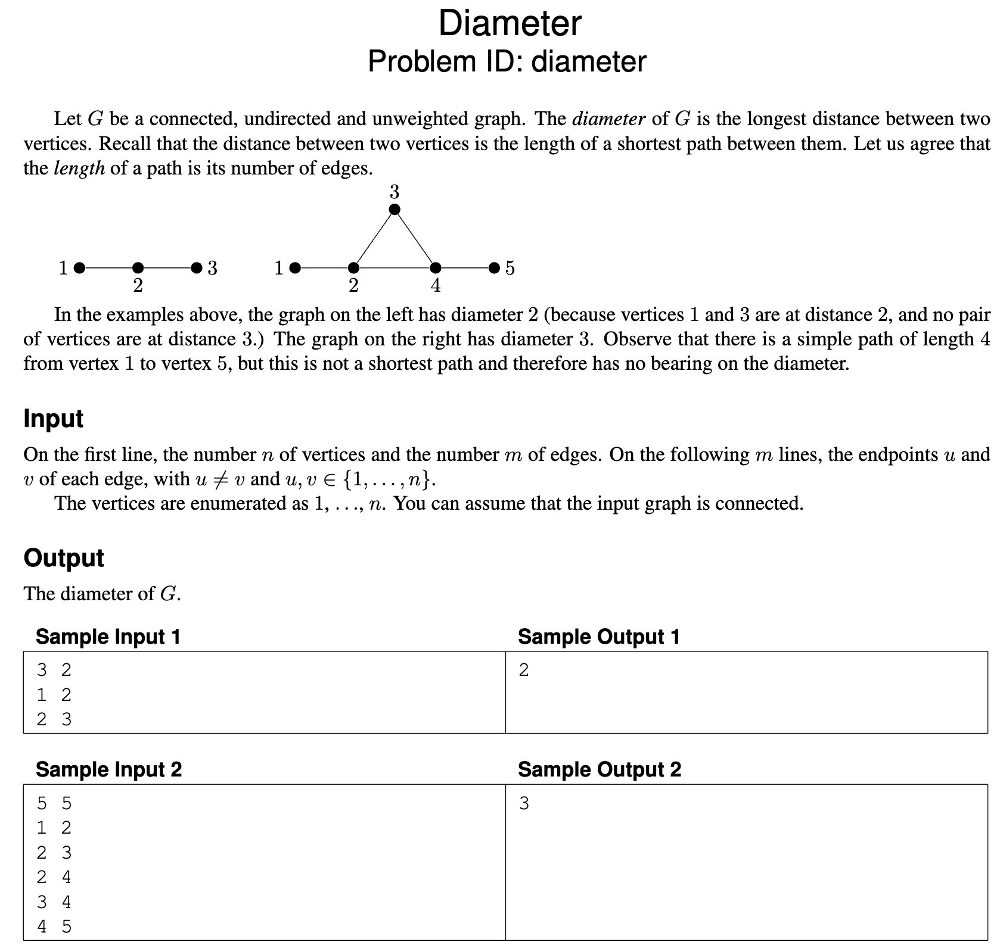
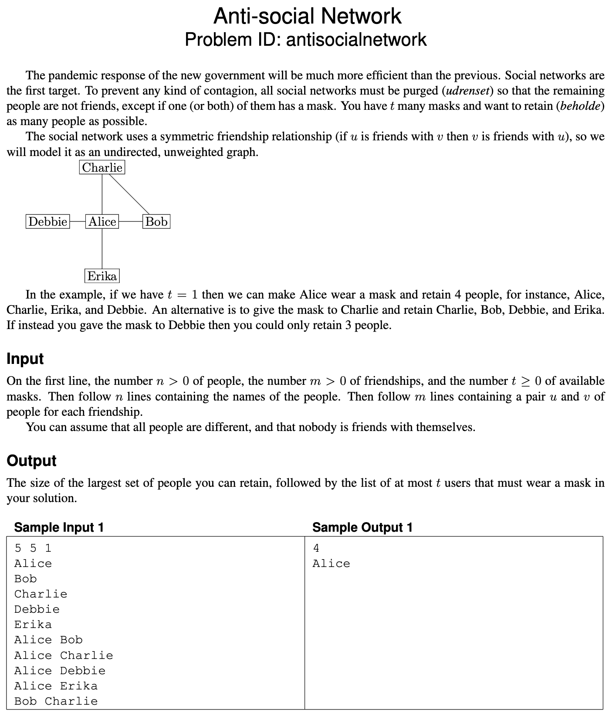
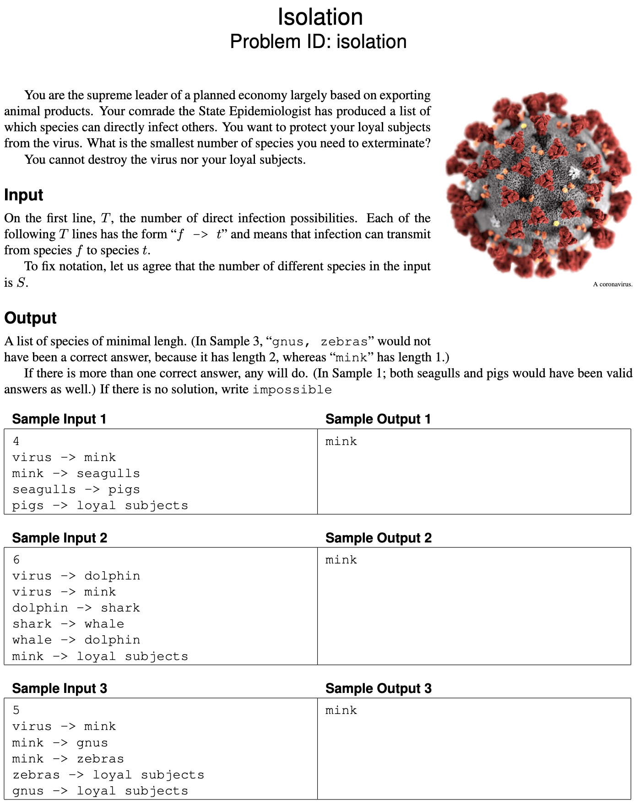
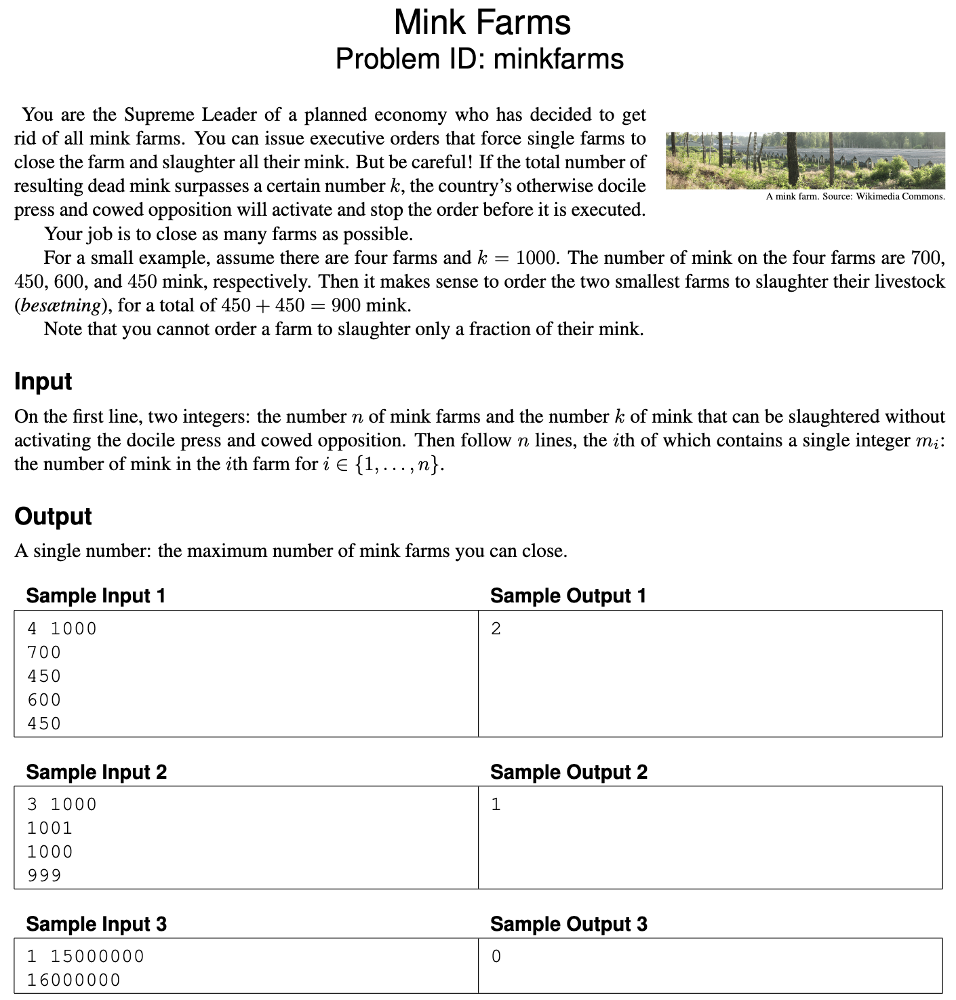
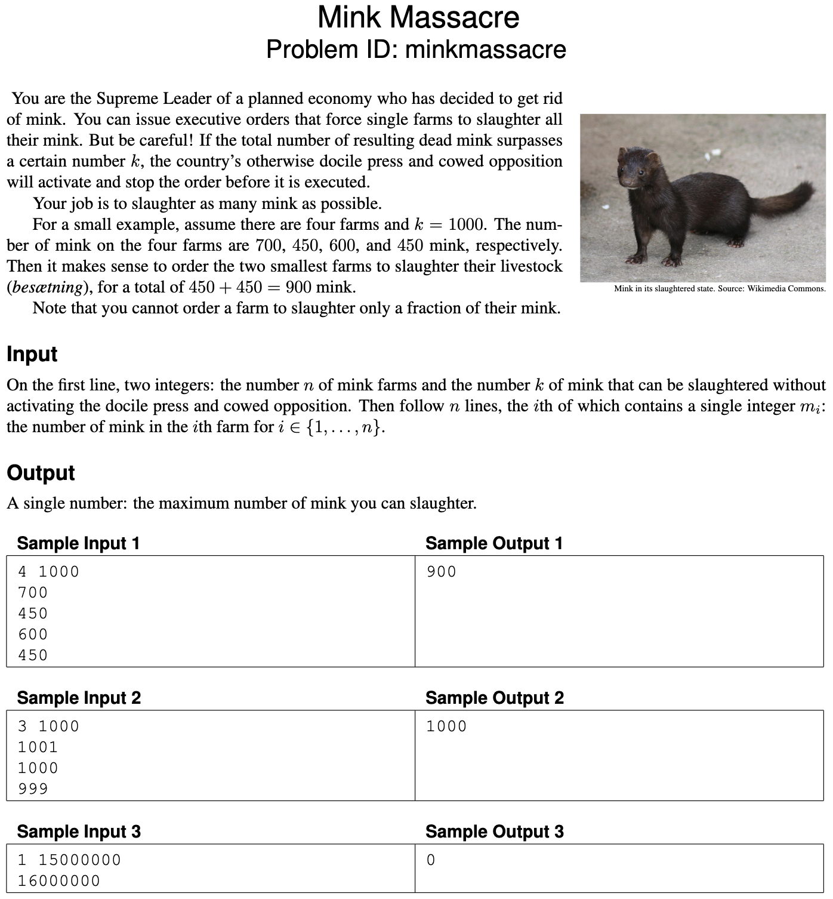
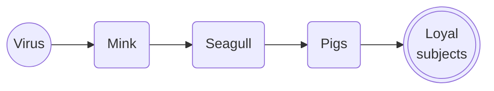
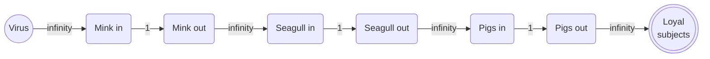
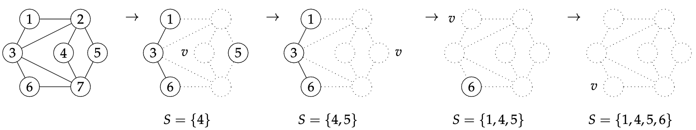
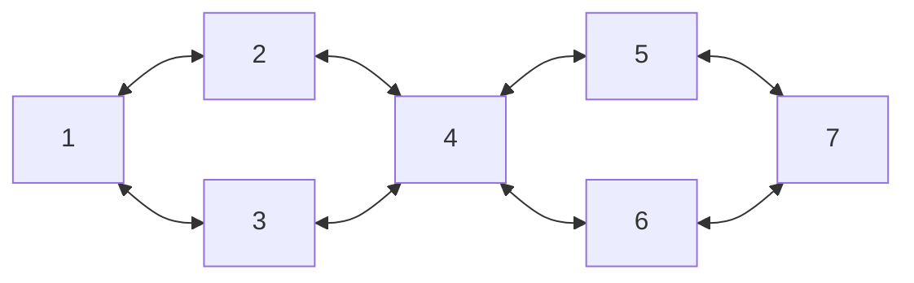

# Exam 2020

- [Exam 2020](#exam-2020)
  - [Problems](#problems)
  - [Problem 1: Diameter - Graph traversal](#problem-1-diameter---graph-traversal)
  - [Problem 2: Anti-social Network - NP-hard](#problem-2-anti-social-network---np-hard)
  - [Problem 3: Isolation - Flow](#problem-3-isolation---flow)
  - [Problem 4: Mink Farms - Greedy](#problem-4-mink-farms---greedy)
  - [Problem 5: Mink Massacre - Dynamic](#problem-5-mink-massacre---dynamic)
  - [Greedy](#greedy)
  - [Graph traversal](#graph-traversal)
  - [Dynamic programming](#dynamic-programming)
  - [Flow](#flow)
  - [NP-hard](#np-hard)
  - [Professor Gecko - Independent Set](#professor-gecko---independent-set)

## Problems

## Problem 1: Diameter - Graph traversal



## Problem 2: Anti-social Network - NP-hard



## Problem 3: Isolation - Flow



## Problem 4: Mink Farms - Greedy



## Problem 5: Mink Massacre - Dynamic



## 1. Greedy

One of the problems in the set can be solved by a simple greedy algorithm.

### 1.a (1 pt.)

Which one?

### 1.a - answer

"Mink Farms" can be solved by a greedy algorithm.

### 1.b (2 pt.)

Describe the algorithm, for example by writing it in pseudocode. (Ignore parsing the input.)  
You probably want to process the input in some order; be sure to make it clear **which order** this is (increasing or decreasing order of start time, alphabetic, colour, age, size, x-coordinate, distance, number of neighbours, scariness, etc.).  
In other words, don’t just write “sort the input.”

### 1.b - answer

- $F$ will denote the set of farms which has a number of minks
- $h$ will denote a heap
- $k$ will denote the maximum number of minks that can be killed
- $n$ will denote the number of farms

```pseudo
function killFarms(F, k) {
  minksLeft = k

  numberOfFarmsToShutDown = 0;

  h = new MinHeap() // Sorted from min to max

  // O(n log n)
  foreach numOfMinks in F {
    h.insert(farm)
  }

  // O(n)
  foreach numOfMinks in h {
    if (maxNumbOfMinks - numOfMinks < 0) return numberOfFarmsToShutDown

    minksLeft -= numOfMinks
    numberOfFarmsToShutDown++
  }
}
```

### 1.c (1 pt.)

State the running time of your algorithm in terms of the input parameters. (It must be polynomial in the input size.)

### 1.c - answer

It would run in: $O(n \log{n})$

## 2. Graph traversal

One of the problems on pages 3–7 can be efficiently solved using (possibly several applications of) standard graph traversal methods (such as breadth-first search, depth-first search, shortest paths, connected components, spanning trees, etc.), and without using more advanced design paradigms such as dynamic programming or network flows.

### 2.a (1 pt.)

Which one?

### 2.a - answer

"Diameter" can be solved using graph traversal.

### 2.b (2 pt.)

Describe your algorithm. As much as you can, make use of known algorithms. (For instance, don’t reinvent a well-known algorithm. Instead, write something like “I will use Blabla’s algorithm [KT, p. 342] to find a blabla in the blabla.”)

### 2.b - answer

To find the diameter of the graph we can use a normal BFS.
Each BFS run will return with the shortest path it has found from the starting node to a leaf node.
We will then run the BFS from each $v \in V$ and take the longest path found.

### 2.c (1 pt.)

State the running time of your algorithm in terms of the parameters of the input.

### 2.c - answer

BFS runs in $O(V + E)$.
Since we have to run that for each $v \in V$ the total running time would be $O(V (V + E))$.
This can be simplified to $O(V^2 + VE)$.

Thus we end up with a polynomial running time.

## 3. Dynamic programming

One of the problems on pages 3–7 is solved by dynamic programming.

### 3.a (1 pt.)

Which one?

### 3.a - answer

"Mink Massacre" can be solved by dynamic programming.

### 3.b (3 pt.)

Following the book’s notation, let OPT(…) denote the value of a partial solution. (Maybe you need more than one parameter, like OPT(i, v). Who knows? Anyway, tell me what the parameters are—vertices, lengths, etc. and what their range is. Use words like “where $i \in \{1, \dots, k^2\}$ denotes the length of BLABLA” or “where $v \in R$ is a red vertex.”)  
Give a recurrence relation for OPT, including relevant boundary conditions and base cases. Which values of OPT are used to answer the problem?

### 3.b - answer

Let $m$ denote the number of minks we can kill, where $m \in \{0, \dots, k\}$ and $k$ is the maximum number of minks we can kill.

Let $i$ denote the current farm we are at, where $i \in \{1, \dots, n\}$ and $n$ is the number of farms.

Let $\text{OPT}(i, m)$ denote the maximum number of minks we can kill from the first $i$ farms, without triggering the docile press of limit $m$.

We will now describe the two cases we can encounter:

1. Exclude the current farm $i$\
  $m_i > m ~,~~ \text{OPT}(i, m) = \text{OPT}(i - 1, m)$
2. Kill the mink $m_i$ from farm $i$\
  $m_i \leq m ~,~~ \text{OPT}(i, m) = m_i \text{OPT}(i - 1, m - m_i)$

Thus the optimal solution can be described as:

$$
\text{OPT}(i, m) = \max(\text{OPT}(i - 1, m), m_i + \text{OPT}(i - 1, m - m_i))
$$

The bases cases are:

- No more farms to visit:
  - $\text{OPT}(0, m) = 0$
- No more minks to kill:
  - $\text{OPT}(i, 0) = 0$

Thus we can set up the following recurrence relation:

$$
\text{OPT}(i, m) =
  \begin{cases}
    0 & \text{if } i = 0 \text{ or } m = 0 \\
    \text{OPS}(i - 1, m) & \text{if } m_i > m \\
    \max(\text{OPS}(i - 1, m), m_i + \text{OPS}(i - 1, m - m_i)) & \text{otherwise} \\
  \end{cases}
$$

Thus the final solution is:

$$
\text{OPT}(n, k)
$$

### 3.c (1 pt.)

State the running time and space of the resulting algorithm in terms of the input parameters.

### 3.c - answer

The running time will be $O(n \times k)$ where n is the number of farms and k is the maximum number of minks we can kill.

The space complexity will be $O(n \times k)$ as well as we have to store the result of each subproblem, thus creating a 2D array of size $n \times k$.

## 4. Flow

One of the problems on pages 3–7 is easily solved by a reduction to network flow.

### 4.a (1 pt.)

Which one?

### 4.a - answer

"Isolation" can be solved by a reduction to network flow.
Where we can then create a min-cut to find the minimum number of species we need to kill to isolate the virus.

### 4.b (3 pt.)

Explain the reduction. Start by drawing the graph corresponding to Sample Input 1. Be ridiculously precise about which nodes and arcs there are, how many there are (in terms of size measures of the original problem), how the nodes are connected and directed, and what the capacities are.  
Describe the reduction in general (use words like “every node corresponding to a giraffe is connected to every node corresponding to a letter by an undirected arc of capacity the length of the neck”).  
What does a maximum flow mean in terms of the original problem, and what size does it have in terms of the original parameters?

### 4.b - answer

For each line we will have to species connected by an infection path.
The species are represented by nodes $v \in V$ in the graph $G$.
The first species points to the second with an edge $e \in E$, representing the infection path.

Thus the input from 1:

```txt
4
virus -> mink
mink -> seagulls
seagulls -> pigs
pigs -> loyal subjects
```

We construct the following graph:



But as we want to use min-cut we will have to make the nodes themselves to the flow restriction points.
Thus we node split and set their capacity to 1, whilst the original edges will have a capacity of infinity.



> Note: The source node is the virus and the sink node is the loyal subjects.

To now find the minimum number of species we need to kill to isolate the virus from the loyal subjects we can run a max-flow algorithm on the graph.

**Reduction** to node-based min-cut:

- Node split all nodes in two where one is the source side and the other is the sink side
  - The arcs between the nodes are directed from the source side to the sink side with capacity of 1
- Set capacity of all edges normal edges to infinity
- Run Max-flow algorithm (e.g Ford-Fulkerson) from the source to the sink
- Run a min-cut algorithm on the residual graph (this is the normal way to do it).
  - Note: The min-cut will identify which nodes we need to kill to isolate the virus as the nodes are now the flow restriction points.

### 4.c (1 pt.)

State the running time of the resulting algorithm, be precise about which flow algorithm you use.  
(Use words like “Using Bellman–Ford (p. 5363 of the textbook), the total running time will be $O(r \cdot t^7 \log^3 e + \log^2 k)$, where $r$ is the number of zebras and $k$ denotes the maximum weight of a giraffe.”)

### 4.c - answer

As we first have to find the max-flow we can use Ford-Fulkerson.
Specifically we can use the Edmonds-Karp algorithm.
Edmonds-Karp runs in $O(VE^2)$.

As we also have to run the min-cut algorithm on the residual graph we will have to add $O(V + E)$ to the running time.
Thus the time complexity remains:

$$
O(VE^2)
$$

## 5. NP-hard

One of the problems on pages 3–7 is NP-hard.

### 5.a (1 pt.)

Which problem is it? (Let’s call it $P_1$.)

### 5.a - answer

"Anti-social Network" is NP-hard.

### 5.b (1 pt.)

The easiest way to show that $P_1$ is NP-hard is to consider another NP-hard problem (called $P_2$). Which one?

### 5.b - answer

We can consider "Minimum Vertex Cover" as $P_2$.

### 5.c (0 pt.)

Do you now need to prove $P_1 \leq_p P_2$ or $P_2 \leq_p P_1$?

### 5.c - answer

I need to prove $P_2 \leq_p P_1$ as this will then show that $P_2$ can be reduced to $P_1$ - thus proving that $P_1$ is NP-hard.

### 5.d (3 pt.)

Describe the reduction. Do this both in general and for a small but complete example. In particular, be ridiculously precise about what instance is **given**, and what instance is **constructed** by the reduction, the parameters of the instance you produce (for example, number of vertices, edges, sets, colors) in terms of the parameters of the original instance, what the solution of the transformed instance means in terms of the original instance, etc. For the love of all that is Good and Holy, please start your reduction with words like “Given an instance to BLABLA, we will construct an instance of BLABLA as follows.”

### 5.d - answer

First I will explain how the "Anti-social Network" problem can be solved:

- We are given a graph $G = (V, E)$
  Where each $V$ is a person and each $E$ is a connection between the two individuals.
- We are also given $t$ which is the available masks we can use to isolate as many individuals as possible.

For each individual $v \in V$, we can run a graph traversal algorithm (e.g., DFS).  
However, the traversal should not terminate when it reaches a leaf node. Instead, it must continue until all nodes are visited.  
While traversing, we alternate giving masks to nodes such that no two adjacent nodes receive a mask.  
This ensures that we use the minimum number of masks required to isolate nodes effectively.

**Reduction** from "Minimum Vertex Cover" to "Anti-social Network":

- Given a graph $G = (V, E)$,
  the result we are looking for is the minimum subset of vertices $S \subseteq V$ such that each edge in $E$ is incident to at least one vertex in $S$.
- This graph can then be given to the "Anti-social Network" algorithm with $t = \infty$ (to allow unlimited masking).
- The solution to the "Anti-social Network" problem will be the minimum number of masks needed to isolate all individuals in the graph.

If the graph is cyclic, the number of masks provided by the solution $t'$ will correspond to the size of the minimum vertex cover multiplied by two.  
If the graph is acyclic, the number of masks provided will correspond to the size of the minimum vertex cover multiplied by two minus one.

This can be expressed as:

```pseudo
minMasks = minAntiSocialNetwork(G, infty)

if G.isCyclic:
    return minMasks * 2
else:
    return minMasks * 2 - 1
```

## 6. Professor Gecko - Independent Set

> Note: The Independent Set is about if a graph has a set of vertices where no two vertices are adjacent.
>
> Below would be a valid independent set if 1 and 2 are in a set,
> but if 1 and 3 are in a set it would not be an independent set as they share an edge.
>
> The edges are supposed to be undirected.
>
> ```mermaid
> graph LR
>    E[1] <--> F[2]
>    E <--> G[3]
>    F <--> H[4]
>    G <--> H
> ```

Professor Gecko has come up with a greedy algorithm for the Independent Set problem.
His idea is to start with an empty $S$ and repeatedly pick a vertex $v \in V$ of minimum degree (= a vertex with the fewest neighbours, ties are broken arbitrarily), add $v$ to $S$, and remove $v$ and its neighbours (including the incident edges).
Repeat until $|S| = k$. To be precise:

```pseudo
S = ∅ // ∅ meaning the empty set
while |S| < k and V ≠ ∅:
  v = vertex of G with minimum degree
  S := S ∪ {v}
  U = neighbours of v
  remove edges with at least one endpoint in U from E
  remove v and every u ∈ U from V
if |S| = k return "yes" else return "no"
```

He proudly shows you that this works on the graph he found in a textbook, where $k$ = 4.



You want to convince him that his algorithm is not correct.
To make sure he realises his folly, you should give two different types of arguments.

1. (a)(2 pt) Argue by counterexample: Draw a concrete instance on which Professor Gecko's algorithm gives the wrong answer.
  Hint: This is not entirely easy.
  The smallest instance where it must fail (no matter how ties are broken) has 7 vertices.
2. (b)(2 pt) Give a complexity-theoretic argument: Explain that *if* Professor Gecko's were correct then P = NP.
  Be brief (three sentences is fine), but do include a relevant analysis of the running time of the good professor's algorithm.

### 6.a - answer



Given that the algorithm is called with $k = 4$ the algorithm might find the correct solution with a set of size $4$ {2, 3, 5, 6}.
However it might find the following solution:

- Pick 1 - remove 2, 3
- Pick 7 - remove 5, 6
- Pick 4

Thus only resulting in a set of size $3$ {1, 4, 7}.

### 6.b - answer

Let's assume instant lookup time for nodes with minimum degree and their neighbors.
While the algorithm processes all nodes $v \in V$ with minimum degree, it will have to remove $v$'s neighbors $u \in V$ and their incident edges $e \in E$.
This results in a running time of $O(V+E)$.
Since the Independent Set problem is NP-complete (not solvable in polynomial time unless $P=NP$), if Professor Gecko's algorithm always worked correctly, it would solve an NP-complete problem in polynomial time.
This would imply $P=NP$, which remains an open question in computer science.
