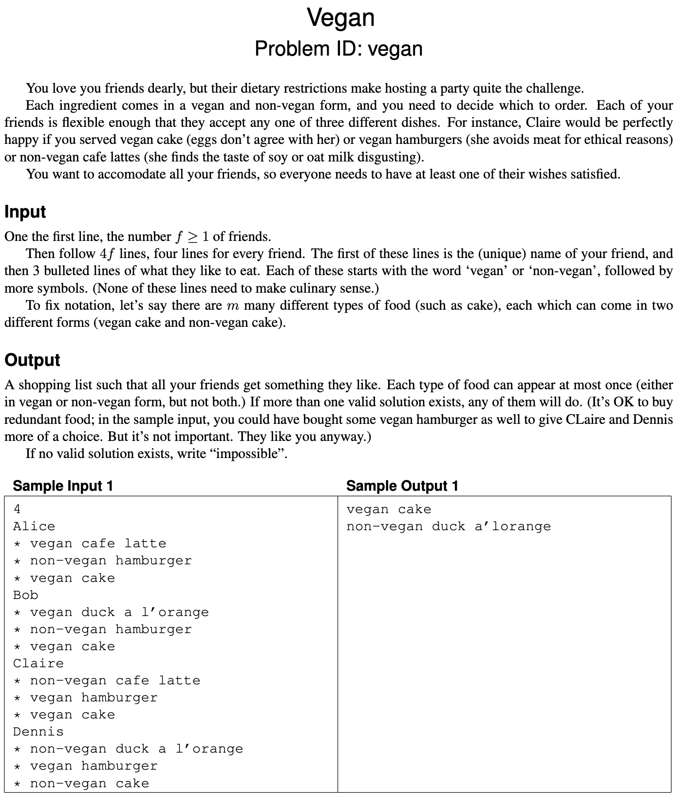

# Exam 2021

## Problems

## Problem 1: Books - Dynamic programming

## Problem 2: Completionist - Greedy

## Problem 3: Inequality - Flow

## Problem 4: Snakes and ladder - Graph traversal?

## Problem 5: Vegan - NP-hard

## 1. Greedy

One of the problems in the set can be solved by a simple greedy algorithm.

### 1.a (1 pt.)

Which one?

### 1.a - Answer

"Completionist" can be solved by a greedy algorithm. 

### 1.b (2 pt.)

Describe the algorithm, for example by writing it in pseudocode. (Ignore parsing the input.)
You probably want to process the input in some order; be sure to make it clear which order this is (increasing or decreasing order of start time, alphabetic, colour, age, size, x-coordinate, distance, number of neighbours, scariness, etc.).
In other words, don’t just write “sort the input.”

### 1.b - Answer

### 1.c (1 pt.)

State the running time of your algorithm in terms of the input parameters. (It must be polynomial in the input size.)

---

## 2. Graph traversal

One of the problems on pages 3–7 can be efficiently solved using (possibly several applications of) standard graph traversal methods (such as breadth-first search, depth-first search, shortest paths, connected components, spanning trees, etc.), and without using more advanced design paradigms such as dynamic programming or network flows.

### 2.a (1 pt.)

Which one?

### 2.b (2 pt.)

Describe the graph. It is often useful to use a concrete instance (such as one of the sample inputs) and draw the graph. In general, what are the vertices? What are the edges? (Are they directed? Do they have weights?) How many vertices and edges are there in terms of the input parameters?

### 2.c (2 pt.)

Describe your algorithm. As much as you can, make use of known algorithms. (For instance, don’t re-invent a well-known algorithm. Instead, write something like “I will use Blabla’s algorithm [KT, p. 342] to find a blabla in the blabla.”) Remember to include phrases like “from starting node BLA” or “beginning with the edge BLA” if that makes sense.

### 2.d (1 pt.)

State the running time of your algorithm in terms of the parameters of the input.

---

## 3. Dynamic programming

One of the problems on pages 3–7 is solved by dynamic programming.

### 3.a (1 pt.)

Which one?

### 3.b (3 pt.)

Following the book’s notation, let OPT(…) denote the value of a partial solution. (Maybe you need more than one parameter, like OPT(i, v).
Who knows?
Anyway, tell me what the parameters are—vertices, lengths, etc. and what their range is.
Use words like “where $i \in \{1, \dots, k^2\}$ denotes the length of BLABLA” or “where $v \in R$ is a red vertex.”)
Give a recurrence relation for OPT, including relevant boundary conditions and base cases.
Which values of OPT are used to answer the problem?

### 3.c (1 pt.)

State the running time and space of the resulting algorithm in terms of the input parameters.
