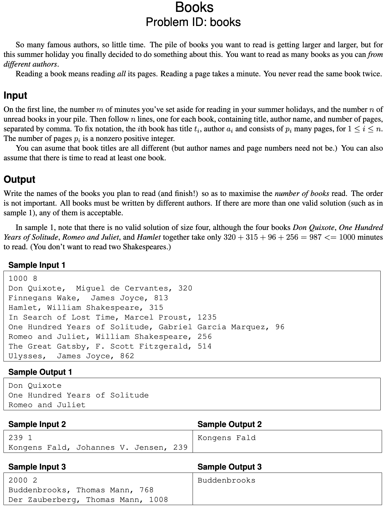
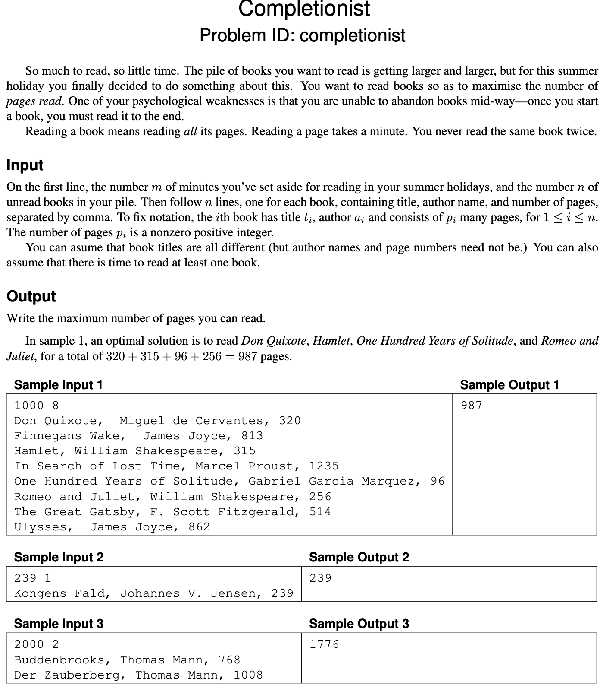
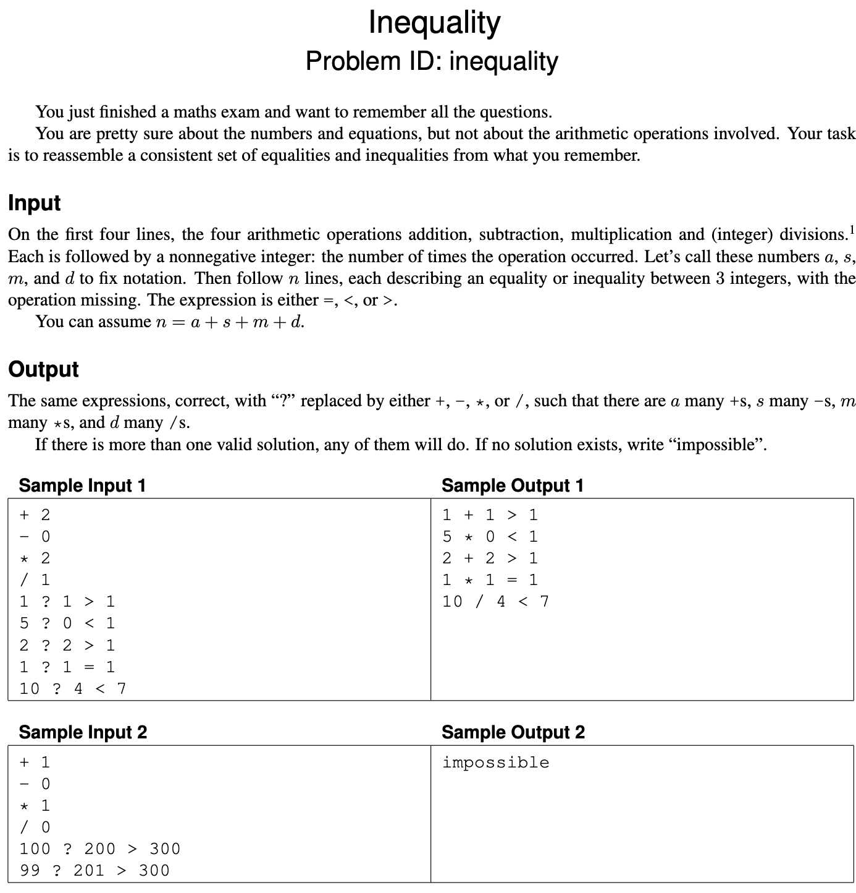
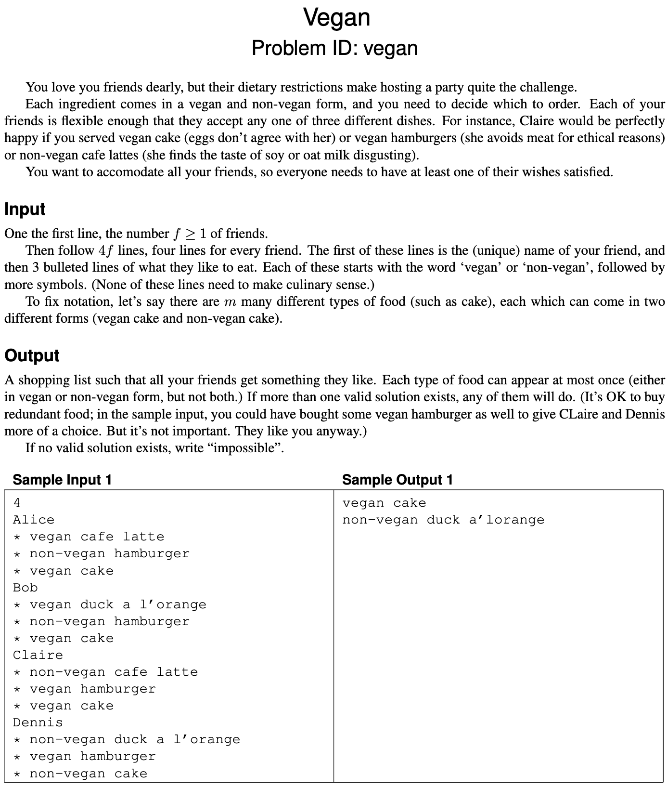
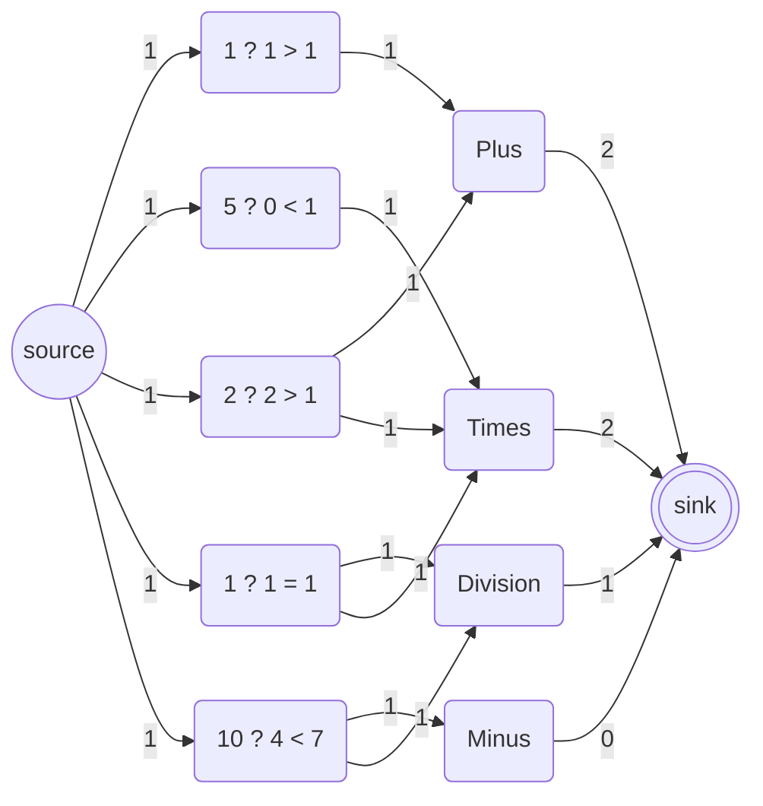

# Exam 2021(2)

## Problems

## Problem 1: Books - Greedy



## Problem 2: Completionist - Dynamic programming



## Problem 3: Inequality - Flow



## Problem 4: Snakes and ladder - Graph traversal?


## Problem 5: Vegan - NP-hard



## 1. Greedy

One of the problems in the set can be solved by a simple greedy algorithm.

### 1.a (1 pt.)

Which one?

### 1.a - Answer

"Books" can be solved by a greedy algorithm.

### 1.b (2 pt.)

Describe the algorithm, for example by writing it in pseudocode. (Ignore parsing the input.)
You probably want to process the input in some order; be sure to make it clear which order this is (increasing or decreasing order of start time, alphabetic, colour, age, size, x-coordinate, distance, number of neighbours, scariness, etc.).
In other words, don’t just write “sort the input.”

### 1.b - Answer

```pseudo
books = [b_1, b_2, ..., b_n]

// Sort books in ascending order of pages
// O(n log n)
books.sortAscending(b.pages)

non_valid_author_set = EmptySet
time/pages_available = m
time/pages_read = 0
books_read = EmptySet


// O(n)
for book in books {
  if (time/pages_read + book.pages) > time/pages_available
    return books_read
  if book.author in non_valid_author_set
    continue
  non_valid_author_set.add(book.author)
  time/pages_read += book.pages
}
```

### 1.c (1 pt.)

State the running time of your algorithm in terms of the input parameters. (It must be polynomial in the input size.)

### 1.c - Answer

If we look away from the loading of the input then the algorithm first sorts the books in terms of pages in ascending order, in $O(n \log n)$ and then iterates over all the books in $O(n)$.
Thus the total running time is:

$$
O(n \log n)
$$

## 2. Graph traversal

One of the problems on pages 3–7 can be efficiently solved using (possibly several applications of) standard graph traversal methods (such as breadth-first search, depth-first search, shortest paths, connected components, spanning trees, etc.), and without using more advanced design paradigms such as dynamic programming or network flows.

### 2.a (1 pt.)

Which one?

### 2.a - Answer

"Snakes and ladder" can be solved by graph traversal.

### 2.b (2 pt.)

Describe the graph. It is often useful to use a concrete instance (such as one of the sample inputs) and draw the graph.
In general, what are the vertices? What are the edges?
(Are they directed? Do they have weights?)
How many vertices and edges are there in terms of the input parameters?

### 2.b - Answer

So the graph we want to draw should be directed.
Thus tile 1 has an directed edge to tile 2 and so on.
Snakes have edges from one tile, $t_1$, to another tile, $t_2$, such that $t_1 > t_2$.
Ladders have edges from one tile, $t_1$, to another tile, $t_2$, such that $t_1 < t_2$.

So for the an input of size $d$ we will have a board of $d \times d$ tiles.
Thus $|V| = d^2$.
As each tile will link to another (except the last tile) we will have $|E| = d^2 - 1$.
Now we also have the snakes and ladders which we respectively have $s$ and $l$ of.
As these are edges we can add them to the total number of edges - resulting in $|E| = d^2 - 1 + s + l$.
Thus:

$$
|V| = d^2, |E| = d^2 - 1 + s + l
$$

### 2.c (2 pt.)

Describe your algorithm. As much as you can, make use of known algorithms. (For instance, don’t re-invent a well-known algorithm. Instead, write something like “I will use Blabla’s algorithm [KT, p. 342] to find a blabla in the blabla.”) Remember to include phrases like “from starting node BLA” or “beginning with the edge BLA” if that makes sense.

### 2.c - Answer

We can now run a BFS from the starting tile to the end tile.
This will provide us with the shortest path, that can both move from tile to tile, but can also utilize the ladders and snakes (in the edge cases where it can be beneficial).

### 2.d (1 pt.)

State the running time of your algorithm in terms of the parameters of the input.

### 2.d - Answer

As we are using a BFS the running time will be $O(V+E)$.
In terms of the original input parameters we have:

$$
O(d^2 + s + l)
$$

## 3. Dynamic programming - Basically Knapsack

One of the problems on pages 3–7 is solved by dynamic programming.

### 3.a (1 pt.)

Which one?

### 3.a - Answer

"Completionist" can be solved by dynamic programming.

### 3.b (3 pt.)

Following the book’s notation, let OPT(…) denote the value of a partial solution. (Maybe you need more than one parameter, like OPT(i, v).
Who knows?
Anyway, tell me what the parameters are—vertices, lengths, etc. and what their range is.
Use words like “where $i \in \{1, \dots, k^2\}$ denotes the length of BLABLA” or “where $v \in R$ is a red vertex.”)
Give a recurrence relation for OPT, including relevant boundary conditions and base cases.
Which values of OPT are used to answer the problem?

### 3.b - Answer

$OPT(i, j)$ denotes the the maximum number of pages/minutes, $i$, we can read within the time, $j$.
Where $0 \leq i \leq m$ and $0 \leq j \leq n$.

$$
OPT(i, j) =
  \begin{cases}
  0 & \text{if } i = 0 \lor j = 0 \\
  OPT(i-1, j) & \text{if } j_i > j \\
  \max\{\text{OPT}(i-1, j), j_i + \text{OPT}(i-1, j-j_i)\} & \text{otherwise}
  \end{cases}
$$

### 3.c (1 pt.)

State the running time and space of the resulting algorithm in terms of the input parameters.

### 3.c - Answer

We have store the computed values in a matrix of size $m \times n$.

Thus both the time complexity and space complexity is:

$$
O(m * n)
$$

## 4. Flow

One of the problems on pages 3–7 is easily solved by a reduction to network flow.

### 4.a (1 pt.)

Which one?

### 4.a - Answer

"Inequality" can be solved by a reduction to network flow.

### 4.b (3 pt.)

Explain the reduction.
Start by drawing the graph corresponding to Sample Input 1.
Be ridiculously precise about which nodes and arcs there are, how many there are (in terms of size measures of the original problem), how the nodes are connected and directed, and what the capacities are. Describe the reduction in general (use words like “every node corresponding to a giraffe is connected to every node corresponding to a letter by an undirected arc of capacity the length of the neck”). What does a maximum flow mean in terms of the original problem, and what size does it have in terms of the original parameters?

### 4.b - Answer

We will create a new source node, $s$, and a new sink node, $t$.
Then we will create nodes for each arithmetic operation with an edge to the sink, with a capacity of the number of times the operation can be used.
Then we will create nodes for each equality/inequality.
These will have edges, of capacity 1, to the arithmetic operation which would make them true.
Also the source will connect to each arithmetic operation with a capacity of 1.

We will then have the following graph:



Now we can try and push $n$ flow from the source node.
If we receive $n$ flow in the sink node then we can identify which edges were used in the residual graph.
If we do not receive $n$ flow then we know that not all equations can be satisfied.

### 4.c (1 pt.)

State the running time of the resulting algorithm, be precise about which flow algorithm you use. (Use words like “Using Bellman–Ford (p. 5363 of the textbook), the total running time will be \(O(r^{17} \log^3 \epsilon + \log^2 k)\), where \(r\) is the number of frontonzes and \(k\) denotes the maximal weight of a giraffe.”)

### 4.c - Answer

As we have to find the max-flow we can use Ford-Fulkerson.
Specifically we can use the Edmonds-Karp algorithm.
Edmonds-Karp runs in $O(VE^2)$.
Dinitz's algorithm further reduces this to $O(V^2E)$.

We have $n$ many equations which in total will have $n$ many edges from the source to themselves and a maximum $4n$ many edges to the arithmetic operations, which there is 4 of.
The arithmetic operations will have a maximum of 4 edges to the sink.
Leaving us with a total number of nodes of $n + 4 + 2$ and a total number of edges of $n + 4n + 4$.

All this can then be reduced from $O(n^2 * n)$ to a running time of:

$$
O(n^3)
$$

## 5. NP-hard

One of the problems on pages 3–7 is NP-hard.

### 5.a (1 pt.)

Which problem is it? (Let’s call it \(P_1\).)

### 5.a - Answer

"Vegan" is NP-hard.

### 5.b (1 pt.)

The easiest way to show that \(P_1\) is NP-hard is to consider another well-known NP-hard problem (called \(P_2\)). Which?

### 5.b - Answer

We can consider "3-SAT" as the well-known NP-hard problem.
Thus $P_2 = \text{3-SAT}$.

### 5.c (0 pt.)

Do you now need to prove \(P_1 \leq_p P_2\) or \(P_2 \leq_p P_1\)?

### 5.c - Answer

We need to prove $P_2 \leq_p P_1$ - thus proving that $P_2$ is reducible to $P_1$ and thereby proving that $P_1$ is NP-hard.

### 5.d (3 pt.)

Describe the reduction.
Do this both in general and for a small but complete example.
In particular, be ridiculously precise about what instance is **given**, and what instance is **constructed** by the reduction, the parameters of the instance you produce (for example number of vertices, edges, sets, colors) in terms of the parameters of the original instance, what the solution of the transformed instance means in terms of the original instance, etc.
For the love of all that is Good and Holy, please start your reduction with words like “Given an instance to BLABLA, we will construct an instance of BLABLA as follows.”

### 5.d - Answer

Given the "3-SAT" instance $X = \{x_1, x_2, \cdot, x_n\}, C_1, C_2, \cdot, C_m$ (where $x_i$ is a boolean and $C_s$ are conjunctions of disjunctions)

Construct instance to "Vegan" $f, F$ (where $F$ is a list of expressions) as follows:

- $f = |C|$ (number of clauses)
- Each $C_i$ consisting of three literals, construct a function $k \in F$:
  - Each $k_i$ takes three boolean variables corresponding to the literals in $C_i$ and evaluates to the logical disjunction (OR operation) of these literals
  - If a literal is negated, replace it with $1 - x$ to represent the negation

```text
F := for each C_i = (x_1, x_2, x_3)
construct an expression
f(x_1) ∨ f(x_2) ∨ f(x_3)
f(x_i) = x[i]      if x_i is a positive literal
(1 - x[i])         if x_i is a negated literal
```

Assume $S$ is an answer to "Vegan".
$S = \{\text{the minimum number of dishes to satisfy all clauses}\}$

**Example** $x = \{x_1, x_2, x_3\}, C_1 = \{\bar{x_1} \lor x_2 \lor x_3\}, \{x_1, x_2 \bar{x_3}\}$

$f = 2$

$$
\text{clause}_1 = \{x_1, x_2, x_3\} = (1 - x_1) \lor x_2 \lor x_3 \\
\text{clause}_2 = \{x_1, x_2, x_3\} = x_1 \lor x_2 \lor (1 - x_3)
$$
