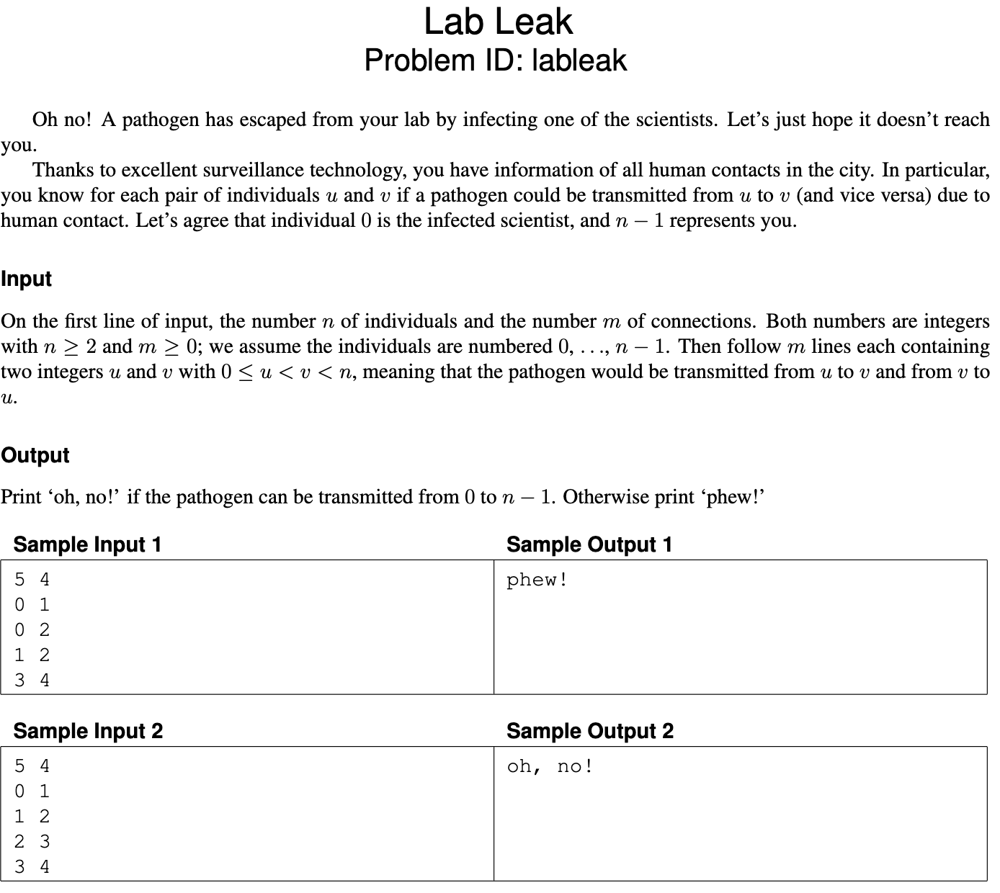
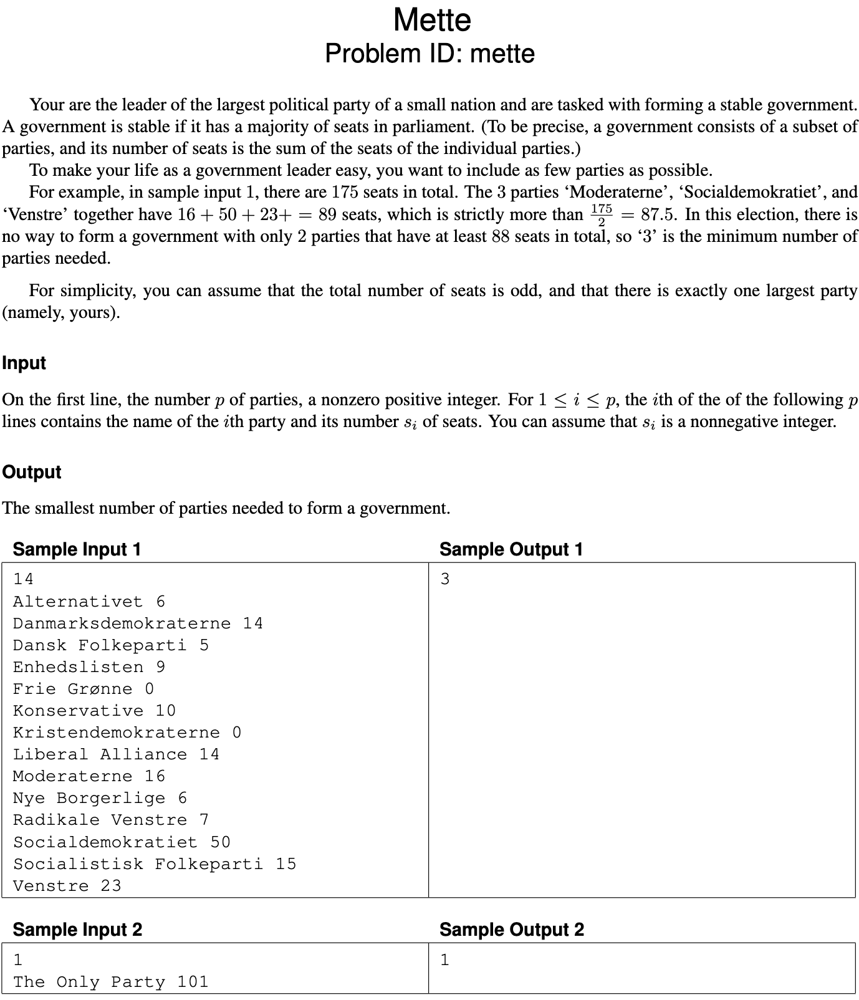
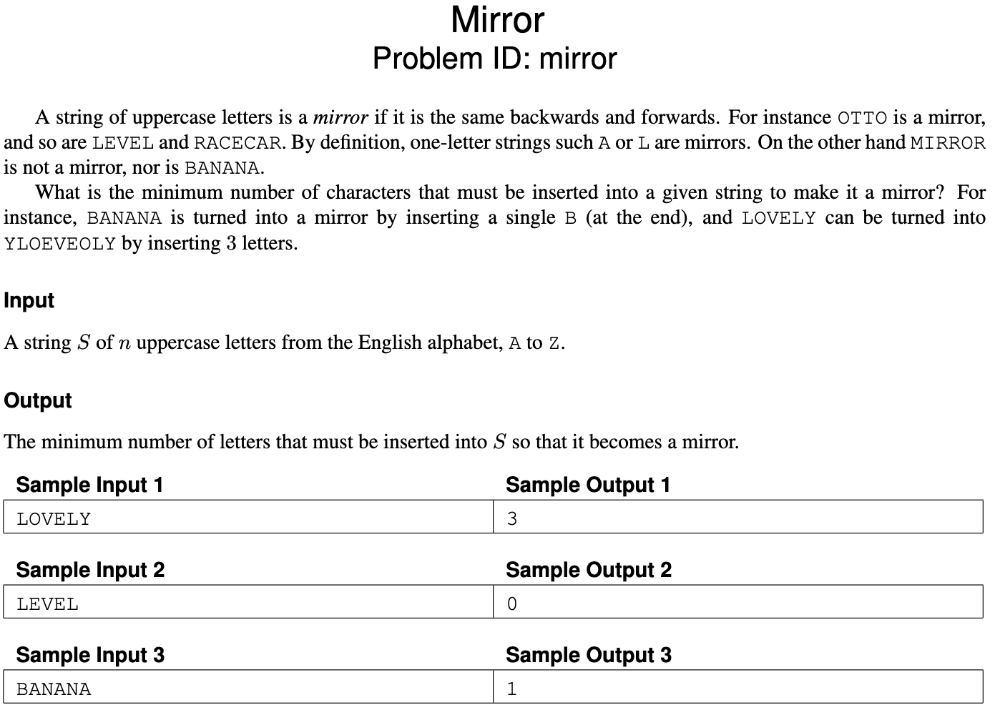
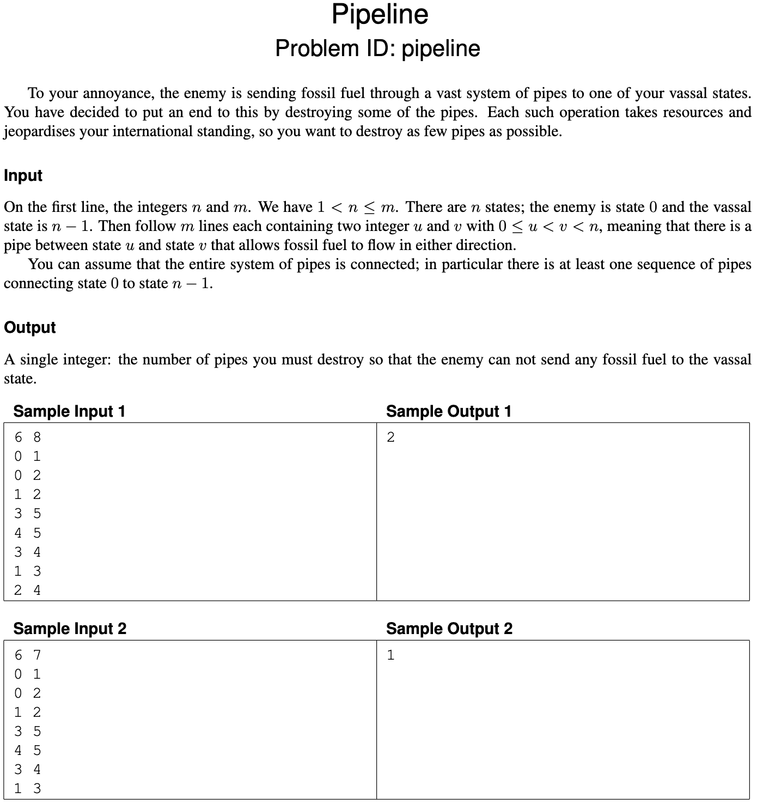
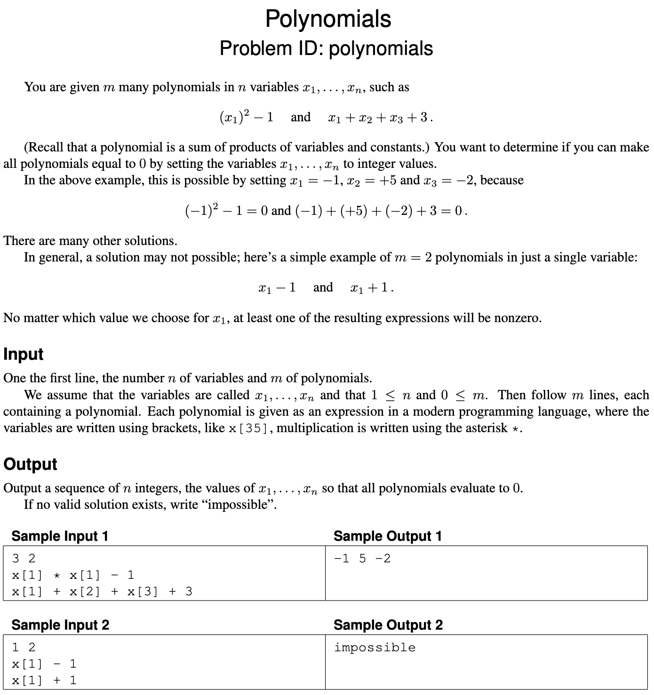
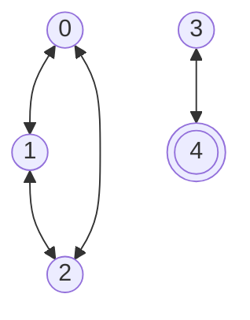
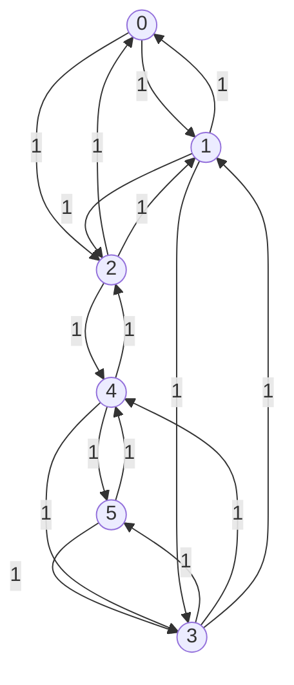

# Exam 2023

- [Exam 2023](#exam-2023)
  - [Problems](#problems)
  - [Problem 1: Lab Leak - Graph Traversal](#problem-1-lab-leak---graph-traversal)
  - [Problem 2: Mette - Greedy](#problem-2-mette---greedy)
  - [Problem 3: Mirror - Dynamic Programming](#problem-3-mirror---dynamic-programming)
  - [Problem 4: Pipeline - Flow](#problem-4-pipeline---flow)
  - [Problem 5: Polynomials - NP-Hard](#problem-5-polynomials---np-hard)
  - [Greedy](#1-greedy)
  - [Graph Traversal](#2-graph-traversal)
  - [Dynamic Programming](#3-dynamic-programming)
  - [Flow](#4-flow)
  - [NP-hard](#5-np-hard)

## Problems

## Problem 1: Lab Leak - Graph Traversal



## Problem 2: Mette - Greedy



## Problem 3: Mirror - Dynamic Programming



## Problem 4: Pipeline - Flow



## Problem 5: Polynomials - NP-Hard



## 1. Greedy

One of the problems on pages 3–7 can be solved by a simple greedy algorithm.

### 1.a (1 pt.)

Which one?

### 1.a - Answer

"Mette" can be solved greedily.

### 1.b (2 pt.)

Describe the algorithm, for example, by writing it in pseudocode. (Ignore parsing the input.) You probably want to process the input in some order; be sure to make it clear which order this is (increasing or decreasing order of start time, alphabetic, colour, age, size, \(x\)-coordinate, distance, number of neighbours, scariness, etc.). In other words, don’t just write “sort the input.”

### 1.b - Answer

```pseudo
def mette(partiesIndividuals){

  // O(n log n)
  partiesIndividuals.sortMaxPeople() // Sort in descending order

  // O(n)
  majority = partiesIndividuals.Sum() / 2

  totalIndividuals = 0
  numberOfParties = 0

  // O(n)
  foreach (individuals in partiesIndividuals){
    if (majority < totalIndividuals) {
      return numberOfParties
    }

    totalIndividuals += individuals
    numberOfParties++
  }

  return "not enough individuals"
}
```

This code would ignore the name of the party and only take the seats into account.
The seats would be sorted from the largest to the smallest.
Then we would calculate the majority of the seats.
Then we would iterate over the sorted list and add the seats to the total until we reach the majority.

### 1.c (1 pt.)

State the running time of your algorithm in terms of the input parameters. (It must be polynomial in the input size.)

### 1.c - Answer

We have the following running times in the algorithm (where n is the number of parties):

- Sorting: $O(n \log n)$
- Summing: $O(n)$
- Iterating: $O(n)$

This can be reduced to $O(n \log n)$.

## 2. Graph Traversal

One of the problems on pages 3–7 can be efficiently solved using (possibly several applications of) standard graph traversal methods (such as breadth-first search, depth-first search, shortest paths, connected components, spanning trees, etc.), and without using more advanced design paradigms such as dynamic programming or network flows.

### 2.a (1 pt.)

Which one?

### 2.a - Answer

"Lab Leak" can be solved with a normal graph traversal algorithm.

### 2.b (1 pt.)

Explain how you model the problem as a graph problem—what are the vertices, what are the edges, how many are there in terms of the parameters of the problem statement, are they directed, weighted, etc. Draw the graph(s) corresponding to the sample input(s).

### 2.b - Answer

These are the denotations:

- The humans will be the vertices $v$
- The human connections will be the edges $e$

There will always be $n$ many vertices and $m$ many edges (the two first integers of the input).

All edges are undirected and unweighted.

**Sample input 1** can be displayed as:



**Sample input 2** can be displayed as:


### 2.c (2 pt.)

Describe your algorithm. Be explicit about arguments such as start vertices, stopping conditions, etc. As much as you can, make use of known algorithms. (For instance, don’t re-invent a well-known algorithm. Instead, write something like “I will use Blabla’s algorithm [KT, p. 342] to find a blabla in the blabla.”)

### 2.c - Answer

> Note: Union find???

We will use a normal DFS algorithm to solve this problem.
This will have to start from $v$ 0 and traverse the graph until we reach $v$ $n-1$ (which is us - can also be seen as the terminal node) or until we have visited all vertices.
If the algorithm reaches the terminal node then we know that the virus has a possible path from the start (the infected) to the end (us) - thus we should print "oh, no!".
If we have visited all vertices and not reached the terminal node then we know that there is a disconnect between the infected and us - thus we should print "phew!".

### 2.d (1 pt.)

State the running time of your algorithm in terms of the parameters of the input.

### 2.d - Answer

We know that the running time of a normal DFS algorithm is \(O(V + E)\) where \(V\) is the number of vertices and \(E\) is the number of edges.

## 3. Dynamic Programming

One of the problems on pages 3–7 is solved by dynamic programming.

### 3.a (1 pt.)

Which one?

### 3.a - Answer

"Mirror" can be solved with dynamic programming.

### 3.b (4 pt.)

Following the book’s notation, let $\text{OPT}(\dots)$ denote the value of a partial solution.
(Maybe you need more than one parameter, like $\text{OPT}(i, v)$. Who knows?
Anyway, tell me what the parameters are—vertices, lengths, etc. and what their range is.
Use words like “where $i \in \{1, \dots, k^2\}$ denotes the length of BLABLA” or “where $v \in R$ is a red vertex.”)
Give a recurrence relation for $\text{OPT}$, including relevant boundary conditions and base cases.
Which values of $\text{OPT}$ are used to answer the problem?

### 3.b - Answer

$\text{OPT}(i,j)$ denotes the lowest number of mismatches in $s[i:j]$ $\text{for } 1 \le i \le j \le n$ (or $\text{for } i,j \in \{1, \dots, n\}$).

$$
\text{OPT}(i,j) =
  \begin{cases}
  0 & \text{if } i \ge j \\
  \text{OPT}(i+1, j-1) & \text{if } s_i = s_j ~(\text{alternatively } s[i] = s[j]) \\
  1+min
    \begin{cases}
      \text{OPT}(i+1, j) \\
      \text{OPT}(i, j-1)
    \end{cases} & \text{otherwise}
  \end{cases}
$$

Thus the solution to the problem is $\text{OPT}(1,n)$.

### 3.c (1 pt.)

State the running time and space of the resulting algorithm in terms of the input parameters.

### 3.c - Answer

As we are building a 2D table and have to calculate all values we will both have a time and space complexity of:

$$
O(n^2)
$$

## 4. Flow

One of the problems on pages 3–7 is easily solved by a reduction to network flow.

### 4.a (1 pt.)

Which one?

### 4.a - Answer

"Pipeline" can be reduced to network flow where min-cut is utilized.

### 4.b (3 pt.)

Explain the reduction. Start by drawing the graph corresponding to Sample Input 1. Be ridiculously precise about which nodes and arcs there are, how many there are (in terms of size measures of the original problem), how the nodes are connected and directed, and what the capacities are.  
Describe the reduction in general (use words like “every node corresponding to a giraffe is connected to every node corresponding to a letter by an undirected arc of capacity the length of the neck”).  
What does a maximum flow mean in terms of the original problem, and what size does it have in terms of the original parameters?

### 4.b - Answer

We have the following denotations:

- $|V| = n$
- $|E| = 2m$

```pseudo
foreach (u,v) in States:
  (u, v) in E, cap 1
  (v, u) in E, cap 1
```

**Sample input 1** can be displayed as:



The source node is the first state, $0$, and the sink node is the last state, $n-1$.
We will have to try to force as much flow as possible from the source to the sink, which will be bounded by $m$.

As we first have to find the max-flow we can use Ford-Fulkerson.
Specifically we can use the Edmonds-Karp algorithm.
Edmonds-Karp runs in $O(VE^2)$.

### 4.c (1 pt.)

State the running time of the resulting algorithm, be precise about which flow algorithm you use.  
(Use words like “Using Krampfmeier–Strumpfnudel’s algorithm ((5.47) in the textbook), the total running time will be \(O(r^{17} \log^3 \epsilon + \log^2 k)\), where \(r\) is the number of froontzes and \(k\) denotes the maximal weight of a giraffe.”)

## 5. NP-hard

One of the problems on pages 3–7 is NP-hard.

### 5.a (1 pt.)

Which problem is it? (Let’s call it $P_1$.)

### 5.a - Answer

"Polynomials" is NP-hard.

### 5.b (1 pt.)

The easiest way to show that $P_1$ is NP-hard is to consider another well-known NP-hard problem (called $P_2$). Which?

### 5.b - Answer

We choose the 3-SAT problem as $P_2$.
Thus $P_2 = \text{3-SAT}$.

### 5.c (0 pt.)

Do you now need to prove $P_1 \leq_p P_2$ or $P_2 \leq_p P_1$?

### 5.c - Answer

We have to prove that "3-SAT" $P_2$ can be reduced to "Polynomials" $P_1$.
Thus:

$$
P_2 \leq_p P_1
$$

### 5.d (3 pt.)

Describe the reduction. Do this both in general and for a small but complete example. In particular, be ridiculously precise about what instance is **given**, and what instance is **constructed** by the reduction, the parameters of the instance you produce (for example, number of vertices, edges, sets, colors) in terms of the parameters of the original instance, what the solution of the transformed instance means in terms of the original instance, etc. For the love of all that is Good and Holy, please start your reduction with words like “Given an instance to BLABLA, we will construct an instance of BLABLA as follows.”

### 5.d - Answer

> Note:
> Remember $x*y*z = 0 \text{ if } 0 \in \{x,y,z\}$

Given a "3-SAT" instance $X=\{x_1, x_2, \dots, x_n\}, C_1, C_2, \dots, C_m$ (where $x_i$ is a boolean and the $C_s$ are a conjunctions of disjunctions).

Construct instance to "Polynomials" $n, m, M$ (where $M$ is a list of expressions) as follows:

- $n = |X|, ~ m = |C|$

```text
M := for each C_i = (x_1, x_2, x_3)
construct an expression
f(x_1)*f(x_2)*f(x_3)
f(x_i) = x[i]   if x_i is false
(1-x[i])        if x_i is true
```

Assume $S$ is an answer to "Polynomials"
If $S = \text{impossible}$ the answer to "3-SAT" is "no"
Otherwise the answer is "yes".

**Example** $x=\{x_1, x_2, x_3\}, C_1 = (\bar{x_1} \lor x_2 \lor x_3), (x_1 \lor x_2 \lor \bar{x_3})$

$n = 3 , ~ m = 2$

$x[1]*(1-x[2])*(1-x[3])$
$(1-x[1])*(1-x[2])*x[3]$
