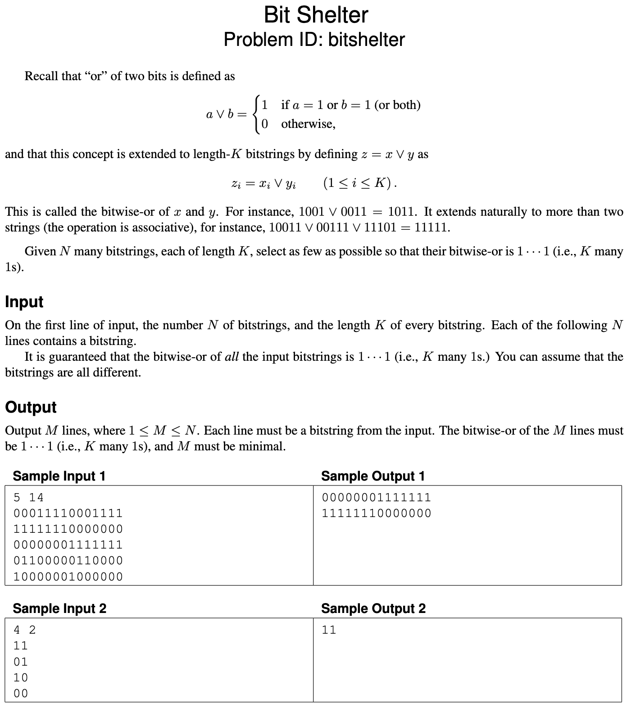
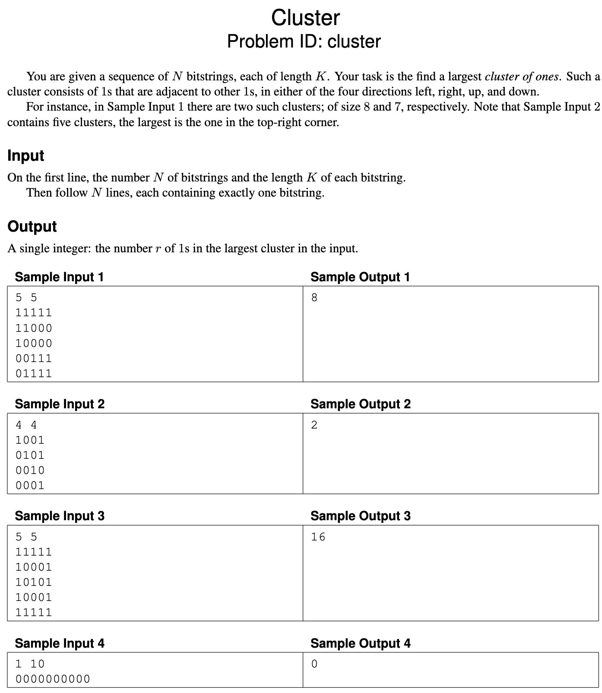
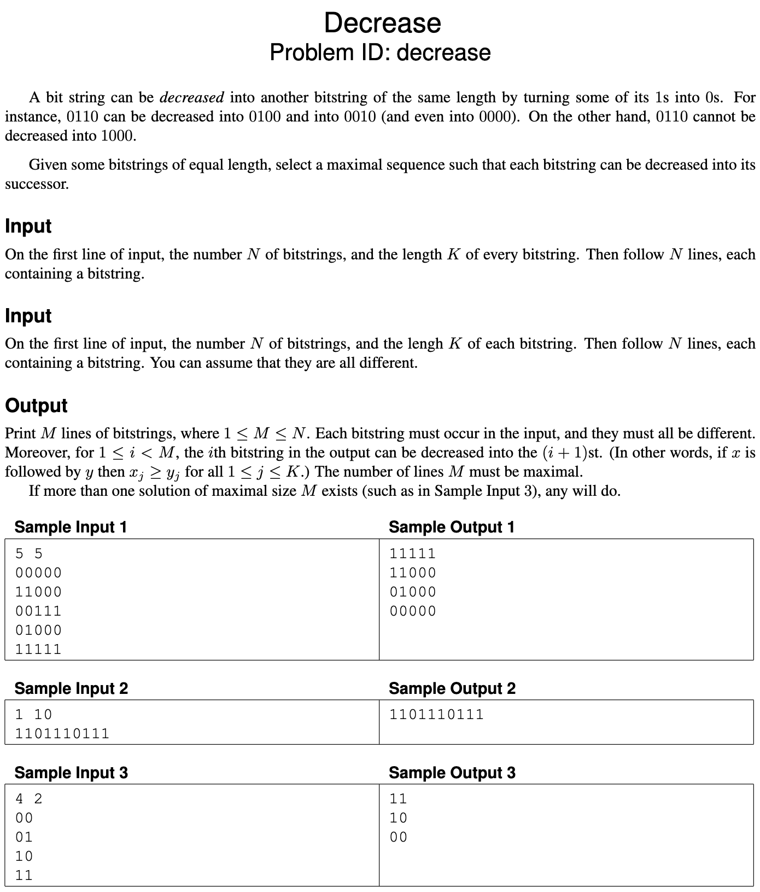
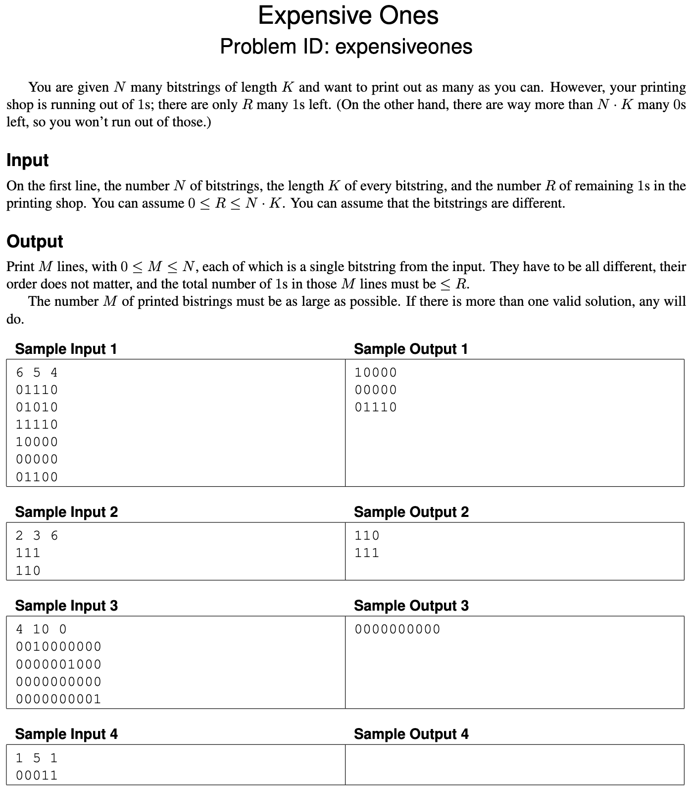
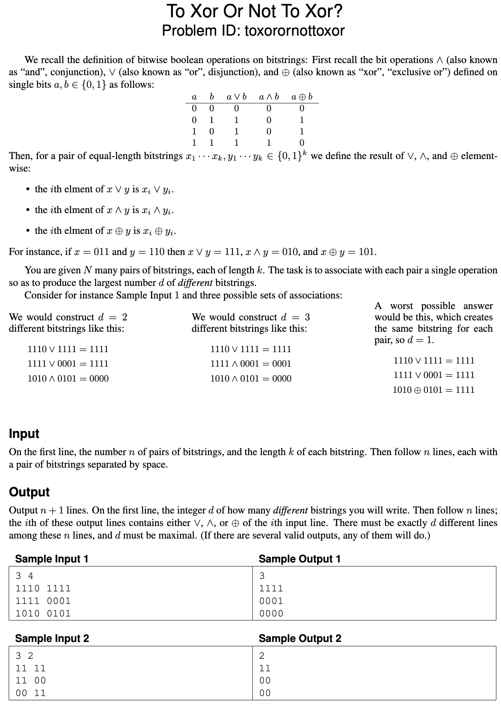
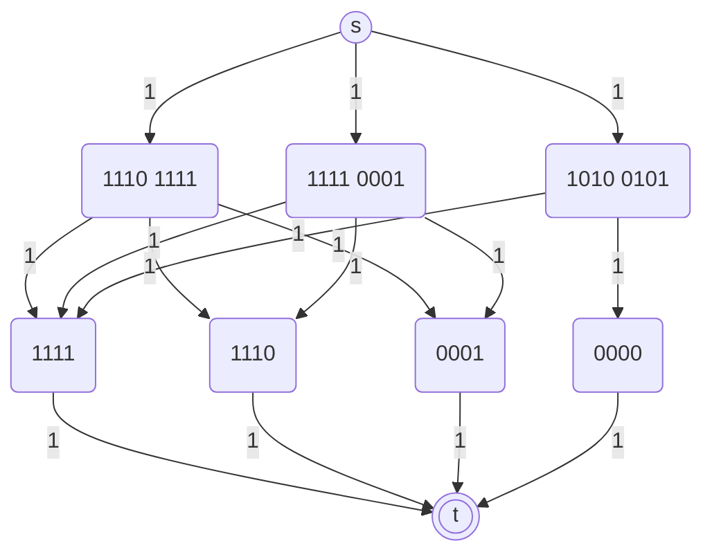

# Exam 2023 Dec

- [Exam 2023 Dec](#exam-2023-dec)
  - [Problems](#problems)
  - [Problem 1: Big shelter - NP-hard](#problem-1-big-shelter---np-hard)
  - [Problem 2: Cluster - Graph traversal](#problem-2-cluster---graph-traversal)
  - [Problem 3: Decrease - Dynamic programming](#problem-3-decrease---dynamic-programming)
  - [Problem 4: Expensive Ones - Greedy](#problem-4-expensive-ones---greedy)
  - [Problem 5: To Xor or not to Xor - Flow](#problem-5-to-xor-or-not-to-xor---flow)
  - [Counterexample](#1-counterexample)
  - [Greedy](#2-greedy)
  - [Graph traversal](#3-graph-traversal)
  - [Dynamic programming](#4-dynamic-programming)
  - [Flow](#5-flow)
  - [NP-hard](#6-np-hard)

## Problems

## Problem 1: Big shelter - NP-hard



## Problem 2: Cluster - Graph traversal



## Problem 3: Decrease - Dynamic programming



## Problem 4: Expensive Ones - Greedy



## Problem 5: To Xor or not to Xor - Flow



## 1. Counterexample

Looking through the problems on pages 3–7, as soon as Gordon Gecko reads the description of problem "Decrease", he is sure it can be solved by a greedy algorithm. His rough idea is the following:  
"First find the bitstring with the most 1s, say $x$, and add it to the solution.
Then consider all bitstrings that $x$ can be decreased into; among those pick the one with the most 1s.
Make that the new $x$; and repeat until no bitstrings are left."

It’s clear that Gordon hasn’t really thought a lot about data structures or running times, but you could probably fix that for him.
However, his idea is wrong on a more fundamental level.

### 1.a (3 pt.)

Give a small but complete instance (as a concrete bitstring) on which Gordon’s algorithm is guaranteed to fail to find an optimal solution.
Specify a non-optimal solution that would be found by Gordon’s algorithm, and what an optimal solution would be instead.

### 1.a - Answer

Consider following input:

```text
0 1 1 1 1
1 1 1 0 0
1 0 0 0 0
```

Gordon's algorithm would pick the first row as it has the most $1$s.
Then he is unable to reduce it to any other row.
Thus outputting:

```text
0 1 1 1 1
```

This is the wrong answer.
The optimal solution is to select the second row first and then the third row.
Thus producing the following output:

```text
1 1 1 0 0
1 0 0 0 0
```

Thus his solution produced $M = 1$ while the optimal solution is $M = 2$.

## 2. Greedy

One of the problems on pages 3–7 can be solved by a simple greedy algorithm.

### 2.a (1 pt.)

Which one?

### 2.a - Answer

"Expensive ones" can be solved by a greedy algorithm.

### 2.b (2 pt.)

Describe the algorithm, for example by writing it in pseudocode. (Ignore parsing the input.) You probably want to process the input in some order; be sure to make it clear *which* order this is (increasing or decreasing order of start time, alphabetic, colour, age, size, x-coordinate, distance, number of neighbours, scariness, etc.). In other words, don’t just write “sort the input.”

### 2.b - Answer

```pseudo
bit_strings = [b_1, b_2, ..., b_n]

// Sort so the bitstring with least 1s is first
// O(n log n)
bitstrings.sort_ascending_by_number_of_ones

remaining_1s = R
selected_bit_strings = {}

// O(n)
foreach bit_string in bit_strings {
  if (selected_bit_strings.contains(bit_string))
    continue
  else if (remaining_1s - bit_string.number_of_ones < 0)
    return selected_bit_strings
  
  remaining_1s -= bit_string.number_of_ones
  selected_bit_strings.add(bit_string)
}
```

### 2.c (1 pt.)

State the running time of your algorithm in terms of the input parameters. (It must be polynomial in the input size.)

### 2.c - Answer

The algorithm sorts the bitstrings according to the number of 1s in ascending order.
This takes $O(n \log n)$ time.
Then we have to iterate trough all the bitstrings, and identify if we can add them to the solution - which takes $O(n)$ time.

Thus if $n$ denotes the amount of bitstrings, the total running time will be:

$$
O(n \log n)
$$

This of course assumes that we can calculate the amount of 1s in each bitstring in constant time.
If this is not the case then let $m$ denote the length of the bitstrings, and the running time will be:

$$
O(n m \log n)
$$

## 3. Graph traversal

One of the problems on pages 3–7 can be efficiently solved using (possibly several applications of) standard graph traversal methods (such as breadth-first search, depth-first search, shortest paths, connected components, spanning trees, etc.), and without using more advanced design paradigms such as dynamic programming or network flows.

### 3.a (1 pt.)

Which one?

### 3.a - Answer

"Cluster" can be solved by graph traversal.

### 3.b (2 pt.)

Describe your algorithm. As much as you can, make use of known algorithms. (For instance, don’t re-invent a well-known algorithm. Instead, write something like “I will use Blabla’s algorithm [KT, p. 342] to find a blabla in the blabla.”)

### 3.b - Answer

We can both use a DFS or BFS to solve this problem.
Let's use a modified BFS.
First let us go trough the 2D array and when we encounter the first 1 we will start a BFS from that point.
Then we will explore all the connected 1s and mark them as visited set (which needs to be global).
While this is done we will create a count how many 1s we encounter.
When no ones are left we will have to look at the rest of the 2D array (which has not been explored) and repeat the process.

Then lastly we can return the largest value or counter registered and then return that as the largest cluster we found.

### 3.c (1 pt.)

State the running time of your algorithm in terms of the parameters of the input.

### 3.c - Answer

The 2D array is bounded by $N$ and $K$.
Thus this can be seen as a graph which at most has $N \cdot K$ vertices and $N \cdot K$ edges.

Thus the running time of the algorithm will be:

$$
O(N \cdot K)
$$

## 4. Dynamic programming

One of the problems on pages 3–7 is solved by dynamic programming.

### 4.a (1 pt.)

Which one?

### 4.a - Answer

"Decrease" can be solved by dynamic programming.

### 4.b (3 pt.)

Following the book’s notation, let OPT(…) denote the value of a partial solution.
(Maybe you need more than one parameter, like OPT(i, v).
Who knows?
Anyway, tell me what the parameters are—vertices, lengths, etc. and what their range is.
Use words like “where $i \in \{1, \dots, k^2\}$ denotes the length of BLABLA” or “where $v \in R$ is a red vertex”.)
Give a recurrence relation for OPT, including relevant boundary conditions and base cases.
Which values of OPT are used to answer the problem?

### 4.b - Answer

Assume all bitstrings $B = \{b_1, b_2, \cdot, b_n\}$ where $b_i$ is a bitstring consisting of 0s and 1s. 
Define a DAG $G = (V, E)$ where:

- $V = B$
- $(u, v) \in E$ if bitstring $u$ can be decreased to bitstring $v$.

$\text{OPT}(b)$ denotes the largest sequence of bitstrings that can be selected.

$$
OPT(b) =
  \begin{cases}
    1 & \text{if } b \text{ has no outgoing edges} \\
    1 + \max_{(u, v) \in E} \text{OPT}(v) & \text{otherwise}
  \end{cases}
$$

Solution is thus:

$$
\max_{b \in B} \text{OPT}(b)
$$

## 5. Flow

One of the problems on pages 3–7 is easily solved by a reduction to network flow.

### 5.a (1 pt.)

Which one?

### 5.a - Answer

"To Xor or not to Xor" can be solved by a reduction to network flow.

### 5.b (3 pt.)

Explain the reduction.
Start by drawing the graph corresponding to Sample Input 1.
Be ridiculously precise about which nodes and arcs there are, how many there are (in terms of size measures of the original problem), how the nodes are connected and directed, and what the capacities are.
Describe the reduction in general (use words like “every node corresponding to a giraffe is connected to every node corresponding to a letter by an undirected arc of capacity the length of the neck”).
What does a maximum flow mean in terms of the original problem, and what size does it have in terms of the original parameters?

### 5.b - Answer

To reduce the problem to a network flow problem we can do the following:

- Create a source node $s$
- Create a sink node $t$
- Create a node for each pair of bitstrings $b_i$
- For each $b_i$ create an arc of capacity 1 to each of the possible bitstrings $s_i$ that can be reached by using each operation
  - There must be no dublicate $s_i$ nodes (meaning no two $s_i$ can have the same value)
- Create an arc of capacity 1 from each $s_i$ to the sink node $t$
- Create an arc of capacity 1 from the source node $s$ to each $b_i$ node

This will result in the following graph from Sample input 1:



We can now $N$ flow trough the graph (denotes the amount of bitstrings).
If we get a flow of $N$ then we have found the a valid solution and can run a DFS on the residual graph to find the unique bitstrings that were selected.

### 5.c (1 pt.)

State the running time of the resulting algorithm, be precise about which flow algorithm you use. (Use words like “Using Krampfmeier–Strumpfnudel’s algorithm ((5.47) in the textbook), the total running time will be $O(r^{17} \log^3 \epsilon + \log^2 k)$, where $r$ is the number of frontonzes and $k$ denotes the maximal weight of a giraffe.”)

### 5.c - Answer

As we have to find the max-flow we can use Ford-Fulkerson.
Specifically we can use the Edmonds-Karp algorithm.
Edmonds-Karp runs in $O(VE^2)$.
Dinitz's algorithm further reduces this to $O(V^2E)$.
Furthermore we have to run a DFS on the residual graph to find the unique bitstrings that were selected.

In the worst case we have $N$ bitstrings pairs, $3N$ possible bitstring results, $2$ extra nodes for the source and sink.
This would result in a total of $4N + 2$ nodes and also $4N + 2$ edges.

Thus the running time of the algorithm will be:

$$
O(N^2)
$$

## 6. NP-hard

One of the problems on pages 3–7 is NP-hard.

### 6.a (1 pt.)

Which problem is it? (Let’s call it $P_1$.)

### 6.a - Answer

"Big shelter" is NP-hard.
Thus $P_1 = \text{Big shelter}$.

### 6.b (1 pt.)

The easiest way to show that $P_1$ is NP-hard is to consider another well-known NP-hard problem (called $P_2$). Which?

### 6.b - Answer

We can consider "Subset-sum" as the known NP-hard problem.
Thus $P_2 = \text{Subset-sum}$.

### 6.c (0 pt.)

Do you now need to prove $P_1 \leq_p P_2$ or $P_2 \leq_p P_1$?

### 6.c - Answer

We need to prove $P_2 \leq_p P_1$.
Thus that "Subset-sum" can be reduced to "Big shelter".

### 6.d (3 pt.)

Describe the reduction.
Do this both in general and for a small but complete example.
In particular, be ridiculously precise about what instance is **given**, and what instance is **constructed** by the reduction, the parameters of the instance you produce (for example number of vertices, edges, sets, colors) in terms of the parameters of the original instance, what the solution of the transformed instance means in terms of the original instance, etc.
For the love of all that is Good and Holy, please start your reduction with words like “Given an instance to BLABLA, we will construct an instance of BLABLA as follows.”

### 6.d - Answer

Given instance $S = \{ s_1, s_2, \dots, s_n \}$ and a target value $T$.
$s_i$ and $T$ are bitstrings of length $K$.

The goal is to select as few $s_i$ as possible such that the sum of the selected $s_i$s equals $T$.
Thus that the bitwise $\text{OR}$ of the selected $s_i$s equal $T$.

Create instance of "Big shelter" as follows:

- For each $s_i \in S$ create a bitstring
- For $T$ create a bitstring of $T$ of $K$ many 1s
- For the sum function replace it with a bitwise OR function

**Example** $S = \{001, 010, 101\}$, $T = 111$

The optimal solution is to select $s_1$ and $s_3$ as $001 \lor 101 = 111$.
