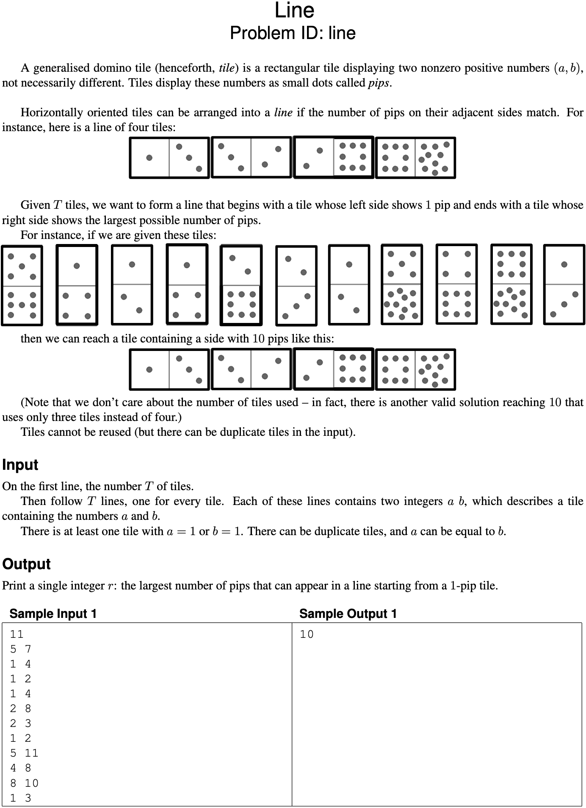
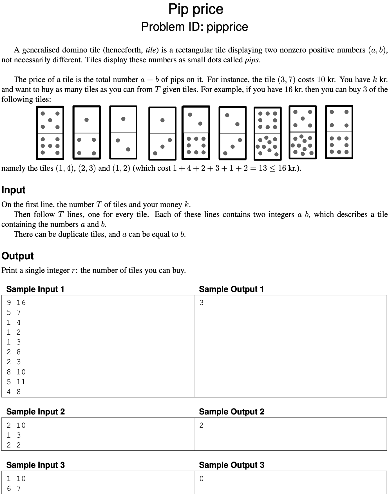
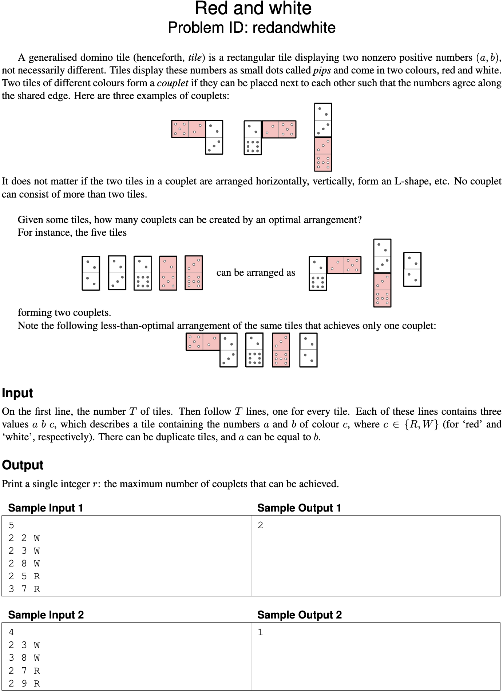
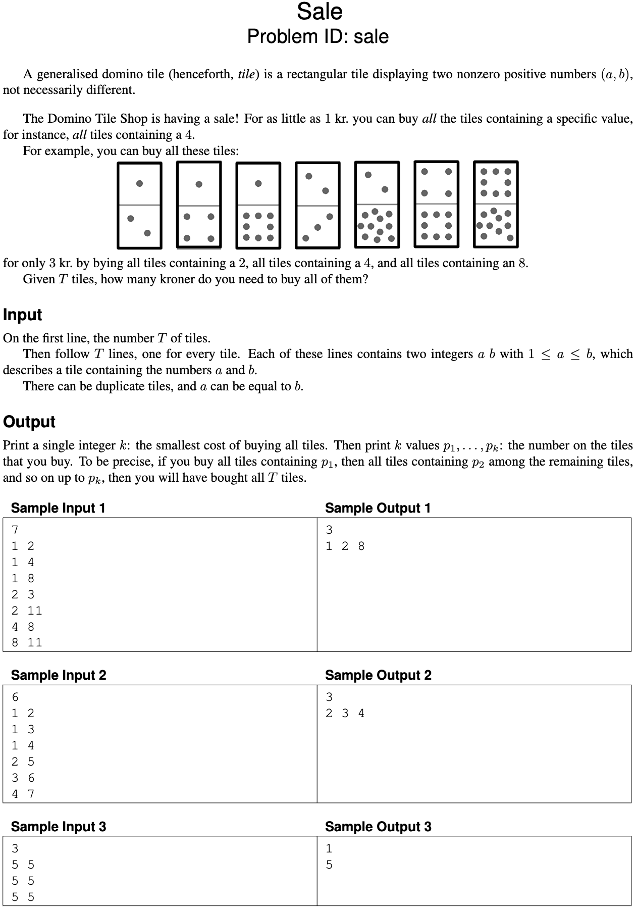
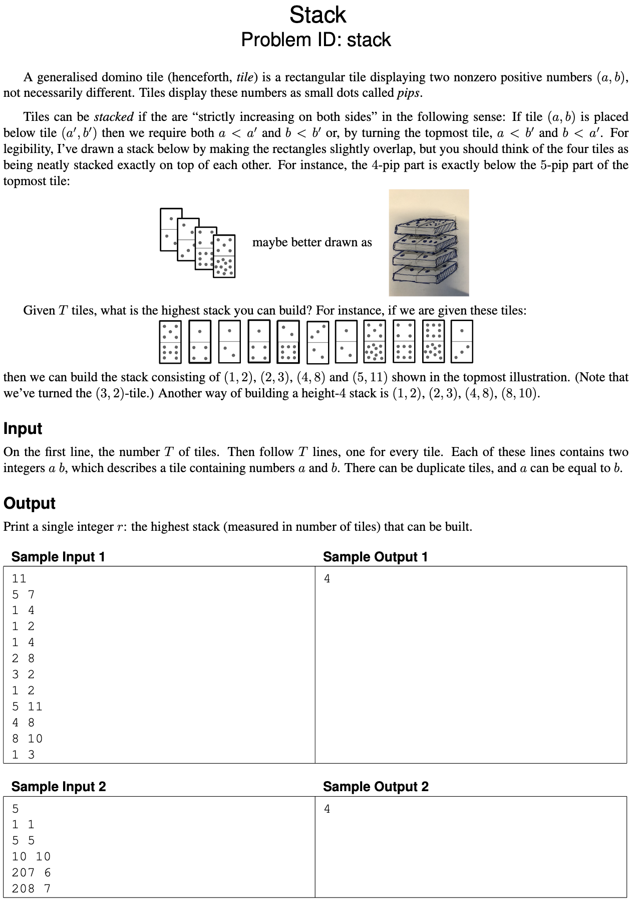
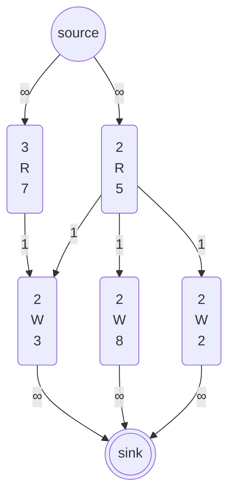

# Exam 2022 January

- [Exam 2022 January](#exam-2022-january)
  - [Problems](#problems)
  - [Problem 1: Line - Graph traversal](#problem-1-line---graph-traversal)
  - [Problem 2: Pip price - Greedy](#problem-2-pip-price---greedy)
  - [Problem 3: Red and white - Flow](#problem-3-red-and-white---flow)
  - [Problem 4: Sale - NP-hard](#problem-4-sale---np-hard)
  - [Problem 5: Stack - Dynamic programming](#problem-5-stack---dynamic-programming)
  - [Counterexample](#1-counterexample)
  - [Greedy](#2-greedy)
  - [Graph Traversal](#3-graph-traversal)
  - [Dynamic programming](#4-dynamic-programming)
  - [Flow](#5-flow)
  - [NP-hard](#6-np-hard)

## Problems

## Problem 1: Line - Graph traversal



## Problem 2: Pip price - Greedy



## Problem 3: Red and white - Flow



## Problem 4: Sale - NP-hard



## Problem 5: Stack - Dynamic programming



## 1. Counterexample

Looking through the problems on pages 3–7, as soon as Gordon Gecko reads the description of problem “Sale”, he is sure it can be solved by a greedy algorithm.
His rough idea is the following: “First determine which value $x$ appears most often on the tiles.
(Careful with tiles of the form $x, x$; you want to count them only once.) Now buy all tiles containing this maximally frequent value $x$, which costs 1 kr. in total.
Continue doing this until there are no more tiles left.”

It’s clear that Gordon hasn’t really thought a lot about data structures or running times, but you could probably fix that for him.
However, his idea is wrong on a more fundamental level.

### 1.a (3 pt.)

Give a concrete, complete instance (either as a cute drawing of tiles or in the input format specified in Sale) on which Gordon’s algorithm fails to find an optimal solution. Specify a nonoptimal solution that would be found by Gordon’s algorithm, and what an optimal solution would be instead.

### 1.a - Answer

```text
 _  _  _  _  _  _
|4||1||1||1||2||3|
|4||4||3||2||2||3|
 ‾  ‾  ‾  ‾  ‾  ‾
```

In the above answer Gordon Geckos algorithm would identify that there are:

| Tiles | Count |
| --- | --- |
| 1 | 3 |
| 2 | 2 |
| 3 | 2 |
| 4 | 2 |

Thus his algorithm would buy the tiles in the following order:

1. Buy 1 - leaving us with

    ```text
     _  _  _
    |4||2||3|
    |4||2||3|
     ‾  ‾  ‾
    ```

2. Buy 2,3, and 4 in any order

Thus resulting in a total cost of 4 kr.

The optimal solution would be to buy the tiles 2, 3, and 4 (in any order) first.
This would thus as result also buy the 1 tiles without any additional cost.
Thus resulting in a total cost of 3 kr.

## 2. Greedy

One of the problems on pages 3–7 can be solved by a simple greedy algorithm.

### 2.a (1 pt.)

Which one?

### 2.a - Answer

"Pip price" can be solved by a simple greedy algorithm.

### 2.b (2 pt.)

Describe the algorithm, for example by writing it in pseudocode. (Ignore parsing the input.) You probably want to process the input in some order; be sure to make it clear which order this is (increasing or decreasing order of start time, alphabetic, colour, age, size, x-coordinate, distance, number of neighbours, scariness, etc.). In other words, don’t just write “sort the input.”

### 2.b - Answer

```pseudo
// List of the summed cost of each tile
// So a tile with pips 1 and 2 would be inserted as 3
T = [t_1, t_2, ..., t_n] // List of tiles

// Sort so cheapest tiles are first
// O(n log n)
T.sortAscendingOrder

k = money available
boughtTiles = 0

// O(n)
foreach (cost in T) {
  if (k < 0) return boughtTiles
  k -= cost
}
```

### 2.c (1 pt.)

State the running time of your algorithm in terms of the input parameters. (It must be polynomial in the input size.)

### 2.c

The algorithm sorts the tiles in $O(n \log n)$ time and then iterates over the tiles in $O(n)$ time.
Thus the total running time of the algorithm is:

$$
O(n \log n)
$$

## 3. Graph Traversal

One of the problems on pages 3–7 can be efficiently solved using (possibly several applications of) standard graph traversal methods (such as breadth-first search, depth-first search, shortest paths, connected components, spanning trees, etc.), and without using more advanced design paradigms such as dynamic programming or network flows.

### 3.a (1 pt.)

Which one?

### 3.a - Answer

"Line" can be solved with a standard graph traversal method, such as DFS or BFS.

### 3.b (2 pt.)

Describe your algorithm. As much as you can, make use of known algorithms. (For instance, don’t reinvent a well-known algorithm. Instead, write something like “I will use Blabla’s algorithm [KT, p. 342] to find a blabla in the blabla.”)

### 3.b - Answer

I will use the BFS algorithm to find a line from a tile with pip 1 to the tile with the maximum pip value.

We thus create a graph $G$ with each pip number $v$ connected with $e$ to the pip number is written in the input.

This means we do not consider a tile as a node, but instead the pip number on the tile as a node.

We can now run a standard BFS from pip 1.
We should keep track of the which maximum pip value we have seen so far.
Then when we have visited every $v \in V$ we can return the max pip value we have seen.

### 3.c (1 pt.)

State the running time of your algorithm in terms of the parameters of the input.

### 3.c - Answer

As we use a standard BFS algorithm the running time of the algorithm is:

$$
O(V + E)
$$

## 4. Dynamic programming

One of the problems on pages 3–7 is solved by dynamic programming.

### 4.a (1 pt.)

Which one?

### 4.a - Answer

"Stack" can be solved by dynamic programming.

### 4.b (3 pt.)

Following the book’s notation, let OPT(…) denote the value of a partial solution. (Maybe you need more than one parameter, like OPT(i, v).
Who knows?
Anyway, tell me what the parameters are—vertices, lengths, etc. and what their range is.
Use words like “where $i \in \{1, \dots, k^2\}$ denotes the length of BLABLA” or “where $v \in R$ is a red vertex.”)
Give a recurrence relation for OPT, including relevant boundary conditions and base cases.
Which values of OPT are used to answer the problem?

### 4.b - Answer

Assume all tiles $(a, b)$ such that $a \leq b$.
Make DAG (Directed Acyclic Graph) from tiles, where:

- $V = \{\text{tiles}\}$
- $(u,v) \in E \text{ if tile} u \text{ can directly stack below tile } v \text{, satisfying:}$
  $(a_u < a_v ~ \land ~ b_u < b_v) \lor (a_u < b_v ~ \land ~ b_u < a_v)$

The tiles now have topological ordering (which means that $v$ connected to $v'$ by $(v, v') \in E$ implies that $v < v'$).

$\text{OPT}(v)$ denotes the highest possible stack height that can be achieved and $v$ being the end node.

$$
\text{OPT}(v) =
  \begin{cases}
    1 & \text{if } v \text{ has no predecessors} \\
    1 + \max_{(u, v) \in E} \text{OPT}(u) & \text{otherwise}
  \end{cases}
$$

Solution is thus:

$$
\max_{v \in V} \text{OPT}(v)
$$

### 4.c (1 pt.)

State the running time and space of the resulting algorithm in terms of the input parameters.

### 4.c - Answer

As we have to build a DAG (which can be represented as an adjacency list) the space complexity would be $O(T + E) \equiv O(T + E)$.
But as we know that there is a maximum of $2T$ edges we can simplify to $O(T)$

Constructing $G$ involves checking all pairs of tiles, resulting in $O(T^2)$ operations in the worst case.
Evaluating $\text{OPT}(v)$ for all tiles $v \in V$, iterating over incoming edges $(u, v)$, takes $O(T + T^2)$, where $T$ accounts for nodes and $T^2$ for edges.
Thus results in a total time complexity of $O(T^2)$.

$$
\text{Space complexity: } O(T) \\
\text{Time complexity: } O(T^2)
$$

## 5. Flow

One of the problems on pages 3–7 is easily solved by a reduction to network flow.

### 5.a (1 pt.)

Which one?

### 5.a - Answer

"Red and white" can be solved by a reduction to network flow.

### 5.b (3 pt.)

Explain the reduction.
Start by drawing the graph corresponding to Sample Input 1.
Be ridiculously precise about which nodes and arcs there are, how many there are (in terms of size measures of the original problem), how the nodes are connected and directed, and what the capacities are.
Describe the reduction in general (use words like “every node corresponding to a giraffe is connected to every node corresponding to a letter by an undirected arc of capacity the length of the neck”).
What does a maximum flow mean in terms of the original problem, and what size does it have in terms of the original parameters?

### 5.b - Answer

If we consider all tiles as vertices $v \in V$ and the then create directed edges from the red to white, with capacity of 1, between all equal pips with different colours $e \in E \text{ if } (v_1, v_2) \text{ where } v_1.\text{pips} = v_2.\text{pips} \land v_1.\text{colour} \neq v_2.\text{colour}$.
We also need to introduce a source and a sink node which respectively will connect to the red nodes and the white nodes and the edges will have a capacity of infinity.
Then we can create the following graph from **sample input 1**:



Now we can then run max flow on the graph.
The resulting flow will be the maximum number of couplets we can create.

### 5.c (1 pt.)

State the running time of the resulting algorithm, be precise about which flow algorithm you use.  
(Use words like “Using Krampfmeier–Strumpfnudel’s algorithm ((5.47) in the textbook), the total running time will be $O(r^{17} \log^3 \epsilon + \log^2 k)$, where $r$ is the number of frontonzes and $k$ denotes the maximal weight of a giraffe.”)

### 5.c - Answer

As we first have to find the max-flow we can use Ford-Fulkerson.
Specifically we can use the Edmonds-Karp algorithm.
Edmonds-Karp runs in $O(VE^2)$.
Dinitz's algorithm further reduces this to $O(V^2E)$.

Thus for this problem we will have number of tiles $T$ as nodes and number of edges as $2T$, as we can maximum have all red tiles connected to all white tiles and the source and sink connected to all red and white tiles.
Thus the running time of the algorithm is:

$$
O(T^2)
$$

## 6. NP-hard

One of the problems on pages 3–7 is NP-hard.

### 6.a (1 pt.)

Which problem is it? (Let’s call it $P_1$.)

### 6.a - Answer

"Sale" is NP-hard.
Thus $P_1 = \text{Sale}$

### 6.b (1 pt.)

The easiest way to show that $P_1$ is NP-hard is to consider another well-known NP-hard problem (called $P_2$). Which?

### 6.b - Answer

We can consider the NP-hard problem "Set cover problem".
Thus $P_2 = \text{Set cover}$

### 6.c (0 pt.)

Do you now need to prove $P_1 \leq_p P_2$ or $P_2 \leq_p P_1$?

### 6.c - Answer

We need to prove that "Set cover", $P_2$, can be reduced to "Sale", $P_1$.
Thus that $P_2 \leq_p P_1$

### 6.d (3 pt.)

Describe the reduction.
Do this both in general and for a small but complete example.
In particular, be ridiculously precise about what instance is **given**, and what instance is **constructed** by the reduction, the parameters of the instance you produce (for example, number of vertices, edges, sets, colors) in terms of the parameters of the original instance, what the solution of the transformed instance means in terms of the original instance, etc.
For the love of all that is Good and Holy, please start your reduction with words like “Given an instance to BLABLA, we will construct an instance of BLABLA as follows.”

### 6.d - Answer

Given "Set cover" instance $U = \{e_1, e_2, \dots, e_n\}$ and subsets $S_1, S_2, \dots, S_m$ where $U$ is the universe of elements and $e_i$ is an element in the universe.

Goal is then to find the minimum number of subsets to cover the universe $U$.

Construct instance to "Sale" as follows:

- For each element $e_i \in U$ create a tile - this will be represented as a tuple $(e_i.\text{a}, e_i.\text{b})$, where both $e_i.\text{a}$ and $e_i.\text{b}$ are placeholders for $e_i$ itself (no actual splitting into separate values).
- For each subset $S_i$, create a subset of all tiles corresponding to elements $e_i \in S_i$.
- In sale select as few subsets $|S|$ as possible to cover all elements in $U$.

**Example**: $U = \{e_1,e_2,e_3,e_4\}$
$S_1 = \{e_1, e_2\} ~ , ~ S_2 = \{e_2, e_3\} ~ , ~ S_3 = \{e_3, e_4\}$

$\text{Tiles} = e_1, e_2, e_3, e_4$
$\text{Pips} = \{(e_1.\text{a}: 1), (e_1.\text{b}: 1), (e_2.\text{a}: 1), (e_2.\text{b}: 2), (e_3.\text{a}: 2), (e_3.\text{b}: 3), (e_4.\text{a}: 3), (e_4.\text{b}: 3)\}$

- **Tiles**: \( e_1, e_2, e_3, e_4 \)
- **Pips**:  
  $$
  \{(e_1.\text{a}: e_1, e_1.\text{b}: e_1), (e_2.\text{a}: e_2, e_2.\text{b}: e_2), (e_3.\text{a}: e_3, e_3.\text{b}: e_3), (e_4.\text{a}: e_4, e_4.\text{b}: e_4)\}
  $$

The solution for this is to buy subsets $S_1$ and $S_3$ which will cover all elements in $U$.
Thus costing us 2 kr.

This reduction ensures $P_2 \leq_p P_1$
