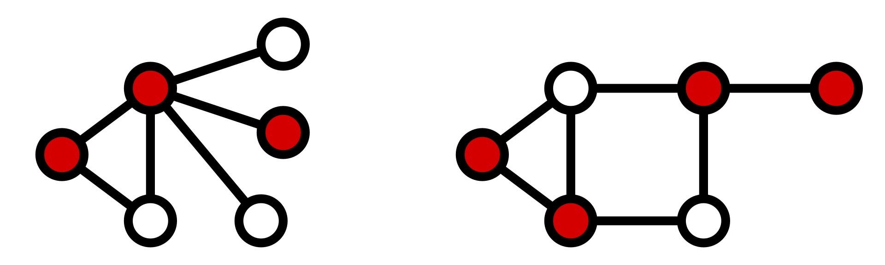

# NP-hard

## 3-SAT

Boolean satisfiability, everything can be reduced from 3-SAT theoretically, as this is how computers "work".  
Given some parameters (true/false, or can be constructed from calculations etc.), and some clauses (a or b or c, or the negated versions), 3-SAT is the problem of finding a combination of true/false parameters that satisfies *all* clauses.

## Longest path

Longest path is about finding the longest simple path between two vertices in a graph. Recall that a simple path does contain repeated vertices.

## Hamiltonian cycle

A graph that contains a Hamiltonian Cycle is called a Hamiltonian Graph. A Hamiltonian Path is a simple path (contains no repeated vertices) that visits each vertex exactly once and thus a Hamiltonian Cycle is a Hamiltonian Path with an extra edge between the first and last point of the path.  
So in essence: a cycle that visits every vertex of a graph exactly once.

## Set cover

A set cover is the problem of finding sets that covers the universe. In other words, consider the "universe" $U = \{1, 2, 3, 4, 5\}$ and the subsets $S = \{\{1, 2, 3\}, \{2, 4\}, \{3, 4\}, \{4, 5\}\}$.
Now we have a solution $C \subseteq S$ such that the union of all sets in $C$ is equivalent to $U$.
Two versions of this problem exists:

- decision problem: Find a set cover of size $k$
- optimization problem: Find a set cover using the fewest number of sets

## Subset-sum

Consider a set of integers $S$ and a target value $T$, the subset-sum then asks if there exists a subset $C \subseteq S$ where the sum of all values in $C$ equals $T$.  
As an example, let $S = \{ -7, -3, -2, 9000, 5, 8 \}$ and $T = 0$, then a solution would be $C = \{ -3, -2, 5 \}$ which sums to $0$.

## Graph coloring

Graph coloring is the problem of coloring a graph - usually vertices or a graph representing a map - such that no two neighbors (vertices, countries, borders) have the same color.
The problem of finding the minimum number of colors required to succeed in the above constraint is NP-complete.
This number is called the *chromatic number*.

## Vertex cover

The problem of finding the smallest set of vertices $C$ in a graph $G(V, E)$ such that every edge $e \in E$ in the graph has an endpoint in at least one of vertices in $C$. Convince yourself that for the below two graphs, it is not possible to find a set of vertices that contains less nodes than the amount of red nodes, but it is possible to find another valid solution, i.e. changing one red to white and white to red and still have an endpoint of all vertices colored red.

Note that there exists the similar but "reversed" problem *edge cover* where the task is to find the minimum number or a set number $k$ of edges such that all vertices has at least one edge with an end at the vertex (Imagine colouring the edges in the above graphs instead of the vertices).

## Knapsack

Knapsack is a problem where you are given a set of items $S$ and for each item in $S$, it contains both a **weight** and a **value**.
You are also given a capacity $k$ and the task is to choose a subset $C ⊆ S$ maximizing the total value of $C$ but having the total weight of $C$ less than the capacity $k$.  
There are variants of this problem; Some where it is possible to select multiple of the same type of item, some where each item can appear in the subset $C$ at most once.
(Technically, $C$ is not a set if it contains duplicates but you get the point Frutte).  
It is possible to solve for small instances both not for massive instances.
